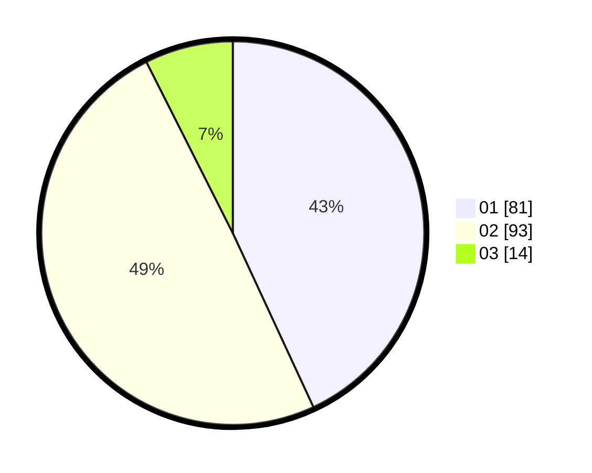

# Hasil

Hasil perolehan suara paslon dapat dilihat pada file paslon-01.txt, paslon-02.txt, dan paslon-03.txt.

Jika tidak ada, artinya data tersebut belum ada pada SIREKAP.

## Perolehan Suara

 * Paslon 01: **81**.
 * Paslon 02: **93**.
 * Paslon 03: **14**.

## Foto C Plano

https://sirekap-obj-formc.kpu.go.id/4786/pemilu/ppwp/31/75/06/10/07/3175061007127-20240214-190027--7ebd654a-ef5e-4f60-866b-7dcc60453987.jpg

https://sirekap-obj-formc.kpu.go.id/4786/pemilu/ppwp/31/75/06/10/07/3175061007127-20240215-122910--b8843a07-1852-451f-89da-35b8202d2c17.jpg

https://sirekap-obj-formc.kpu.go.id/4786/pemilu/ppwp/31/75/06/10/07/3175061007127-20240214-190534--4f13cc85-49fb-40d5-850a-d6b377b556ab.jpg

## DATA PEMILIH TETAP

Jumlah pemilih dalam DPT: **261**.
 * L: **133**.
 * P: **128**.

## DATA PENGGUNA HAK PILIH

Jumlah pengguna hak pilih dalam DPT: **183**.
 * L: **92**.
 * P: **91**.

Jumlah pengguna hak pilih dalam DPTb: **2**.
 * L: **1**.
 * P: **1**.

Jumlah pengguna hak pilih dalam DPK: **4**.
 * L: **2**.
 * P: **2**.

Jumlah pengguna hak pilih: **189**.
 * L: **95**.
 * P: **94**.

## JUMLAH SUARA SAH DAN TIDAK SAH

JUMLAH SELURUH SUARA SAH: **188**.

JUMLAH SUARA TIDAK SAH: **1**.

JUMLAH SELURUH SUARA SAH DAN SUARA TIDAK SAH: **189**.
