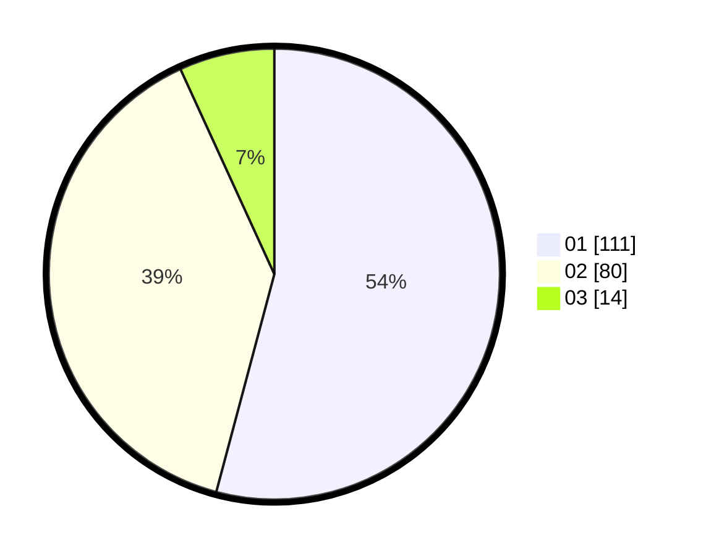

# Hasil

Hasil perolehan suara paslon dapat dilihat pada file paslon-01.txt, paslon-02.txt, dan paslon-03.txt.

Jika tidak ada, artinya data tersebut belum ada pada SIREKAP.

## Perolehan Suara

 * Paslon 01: **111**.
 * Paslon 02: **80**.
 * Paslon 03: **14**.

## Foto C Plano

https://sirekap-obj-formc.kpu.go.id/da3b/pemilu/ppwp/31/75/06/10/07/3175061007130-20240215-011144--9ea47c92-2917-4fb6-8ed5-d3f688c78231.jpg

https://sirekap-obj-formc.kpu.go.id/da3b/pemilu/ppwp/31/75/06/10/07/3175061007130-20240215-011102--38fb7f98-8dc8-4326-bbe0-01006a0858a0.jpg

https://sirekap-obj-formc.kpu.go.id/da3b/pemilu/ppwp/31/75/06/10/07/3175061007130-20240214-204822--c4588648-4aef-4490-857b-ffdfa92c3ddd.jpg
