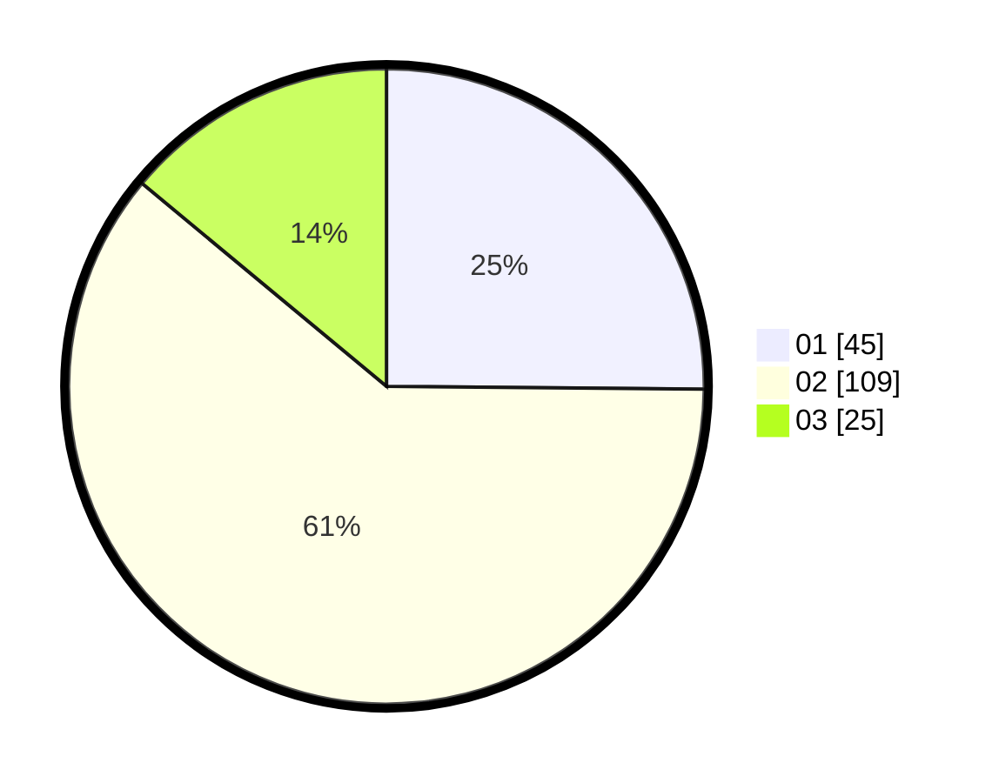

# Hasil

Hasil perolehan suara paslon dapat dilihat pada file paslon-01.txt, paslon-02.txt, dan paslon-03.txt.

Jika tidak ada, artinya data tersebut belum ada pada SIREKAP.

## Perolehan Suara

 * Paslon 01: **45**.
 * Paslon 02: **109**.
 * Paslon 03: **25**.

## Foto C Plano

https://sirekap-obj-formc.kpu.go.id/651f/pemilu/ppwp/31/75/06/10/07/3175061007144-20240214-224659--16eceeb5-f842-4034-993d-78db327ec8cb.jpg

https://sirekap-obj-formc.kpu.go.id/651f/pemilu/ppwp/31/75/06/10/07/3175061007144-20240214-224829--827edb61-8934-40d8-a452-887303f8d941.jpg

https://sirekap-obj-formc.kpu.go.id/651f/pemilu/ppwp/31/75/06/10/07/3175061007144-20240214-204940--b199e9eb-64ad-4aae-8bd0-dcba0a0738c4.jpg
