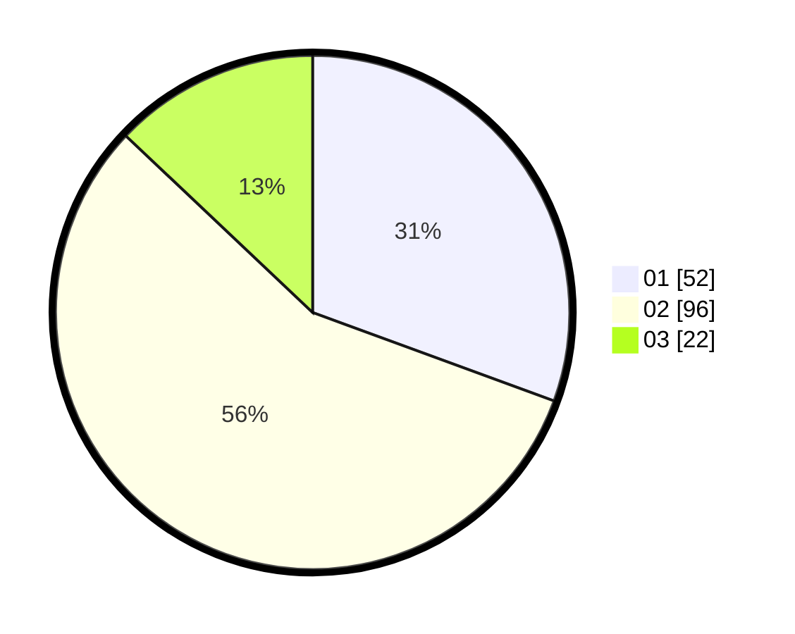

# Hasil

Hasil perolehan suara paslon dapat dilihat pada file paslon-01.txt, paslon-02.txt, dan paslon-03.txt.

Jika tidak ada, artinya data tersebut belum ada pada SIREKAP.

## Perolehan Suara

 * Paslon 01: **52**.
 * Paslon 02: **96**.
 * Paslon 03: **22**.

## Foto C Plano

https://sirekap-obj-formc.kpu.go.id/0100/pemilu/ppwp/31/75/06/10/07/3175061007147-20240215-000421--6cf6d193-a759-4faa-b8b4-ad3032d48595.jpg

https://sirekap-obj-formc.kpu.go.id/0100/pemilu/ppwp/31/75/06/10/07/3175061007147-20240215-001037--a99ff498-8d10-45d2-b194-abcc383d90d7.jpg

https://sirekap-obj-formc.kpu.go.id/0100/pemilu/ppwp/31/75/06/10/07/3175061007147-20240215-001204--115784c8-f2fc-43bd-8261-186e7fa2b29e.jpg
