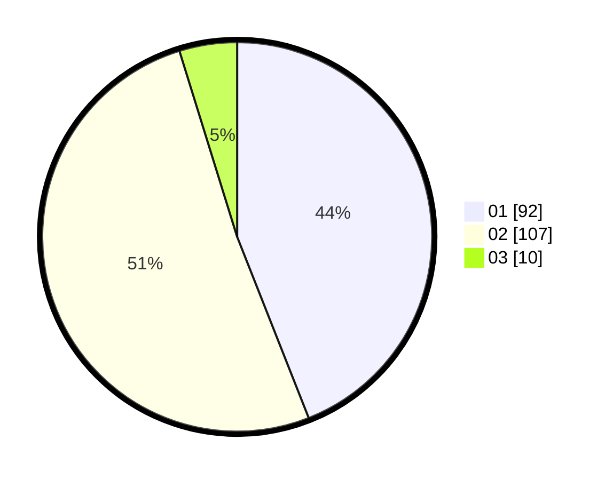

# Hasil

Hasil perolehan suara paslon dapat dilihat pada file paslon-01.txt, paslon-02.txt, dan paslon-03.txt.

Jika tidak ada, artinya data tersebut belum ada pada SIREKAP.

## Perolehan Suara

 * Paslon 01: **92**.
 * Paslon 02: **107**.
 * Paslon 03: **10**.

## Foto C Plano

https://sirekap-obj-formc.kpu.go.id/30fd/pemilu/ppwp/31/75/06/10/07/3175061007182-20240214-155216--58a48bb8-633d-4f03-966c-d2cd61647ec4.jpg

https://sirekap-obj-formc.kpu.go.id/30fd/pemilu/ppwp/31/75/06/10/07/3175061007182-20240214-155233--3076a9e0-0f16-495d-80d5-8581caf792a1.jpg

https://sirekap-obj-formc.kpu.go.id/30fd/pemilu/ppwp/31/75/06/10/07/3175061007182-20240214-155247--f3414b8e-d7f3-490b-a49e-4ff9c82e28bf.jpg

## DATA PEMILIH TETAP

Jumlah pemilih dalam DPT: **257**.
 * L: **128**.
 * P: **129**.

## DATA PENGGUNA HAK PILIH

Jumlah pengguna hak pilih dalam DPT: **207**.
 * L: **100**.
 * P: **107**.

Jumlah pengguna hak pilih dalam DPTb: **0**.
 * L: **0**.
 * P: **0**.

Jumlah pengguna hak pilih dalam DPK: **5**.
 * L: **2**.
 * P: **3**.

Jumlah pengguna hak pilih: **212**.
 * L: **102**.
 * P: **110**.

## JUMLAH SUARA SAH DAN TIDAK SAH

JUMLAH SELURUH SUARA SAH: **209**.

JUMLAH SUARA TIDAK SAH: **3**.

JUMLAH SELURUH SUARA SAH DAN SUARA TIDAK SAH: **212**.
