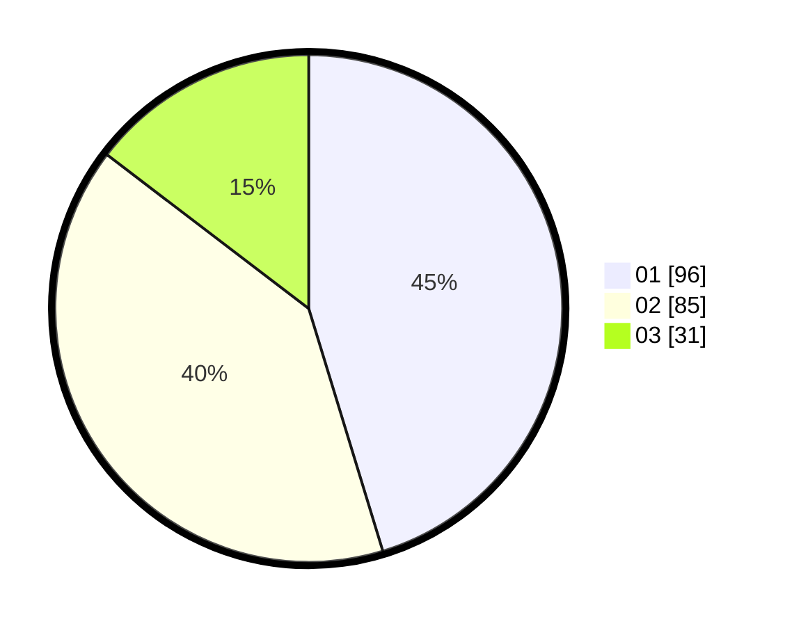

# Hasil

Hasil perolehan suara paslon dapat dilihat pada file paslon-01.txt, paslon-02.txt, dan paslon-03.txt.

Jika tidak ada, artinya data tersebut belum ada pada SIREKAP.

## Perolehan Suara

 * Paslon 01: **96**.
 * Paslon 02: **85**.
 * Paslon 03: **31**.

## Foto C Plano

https://sirekap-obj-formc.kpu.go.id/4bcc/pemilu/ppwp/31/75/07/10/01/3175071001002-20240214-194701--fe19794c-3458-438d-a217-416831affeb7.jpg

https://sirekap-obj-formc.kpu.go.id/4bcc/pemilu/ppwp/31/75/07/10/01/3175071001002-20240214-194219--40574537-ae20-43b4-a635-b66bf1138927.jpg

https://sirekap-obj-formc.kpu.go.id/4bcc/pemilu/ppwp/31/75/07/10/01/3175071001002-20240214-194738--f5a90e22-3558-40da-8879-7fe7042e0b02.jpg
