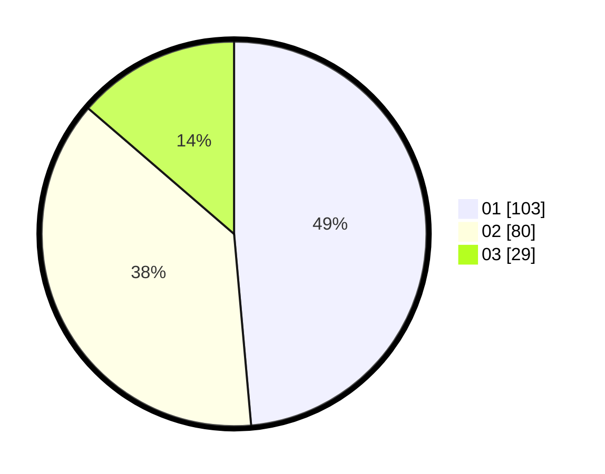

# Hasil

Hasil perolehan suara paslon dapat dilihat pada file paslon-01.txt, paslon-02.txt, dan paslon-03.txt.

Jika tidak ada, artinya data tersebut belum ada pada SIREKAP.

## Perolehan Suara

 * Paslon 01: **103**.
 * Paslon 02: **80**.
 * Paslon 03: **29**.

## Foto C Plano

https://sirekap-obj-formc.kpu.go.id/2974/pemilu/ppwp/31/75/07/10/01/3175071001003-20240214-192935--987a4024-9e17-43cd-9072-37a9466a637f.jpg

https://sirekap-obj-formc.kpu.go.id/2974/pemilu/ppwp/31/75/07/10/01/3175071001003-20240214-193044--5c8eb704-df74-46b9-8b30-6eed1fca66e5.jpg

https://sirekap-obj-formc.kpu.go.id/2974/pemilu/ppwp/31/75/07/10/01/3175071001003-20240214-193124--e10fbf18-32a6-4be0-9518-affc0250ebda.jpg

## DATA PEMILIH TETAP

Jumlah pemilih dalam DPT: **270**.
 * L: **134**.
 * P: **136**.

## DATA PENGGUNA HAK PILIH

Jumlah pengguna hak pilih dalam DPT: **210**.
 * L: **100**.
 * P: **110**.

Jumlah pengguna hak pilih dalam DPTb: **0**.
 * L: **0**.
 * P: **0**.

Jumlah pengguna hak pilih dalam DPK: **5**.
 * L: **2**.
 * P: **3**.

Jumlah pengguna hak pilih: **215**.
 * L: **102**.
 * P: **113**.

## JUMLAH SUARA SAH DAN TIDAK SAH

JUMLAH SELURUH SUARA SAH: **212**.

JUMLAH SUARA TIDAK SAH: **3**.

JUMLAH SELURUH SUARA SAH DAN SUARA TIDAK SAH: **215**.
