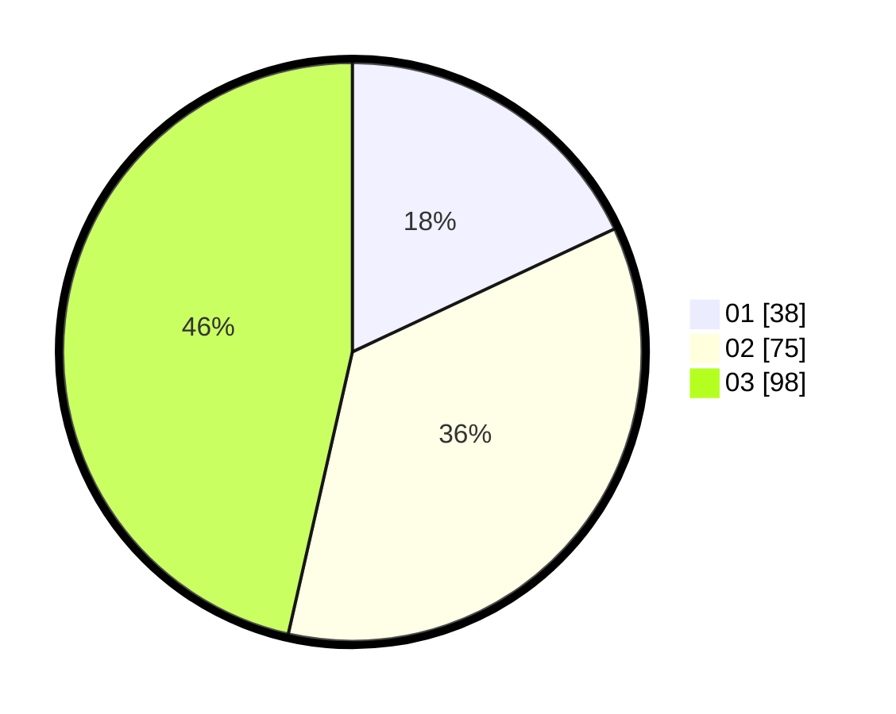

# Hasil

Hasil perolehan suara paslon dapat dilihat pada file paslon-01.txt, paslon-02.txt, dan paslon-03.txt.

Jika tidak ada, artinya data tersebut belum ada pada SIREKAP.

## Perolehan Suara

 * Paslon 01: **38**.
 * Paslon 02: **75**.
 * Paslon 03: **98**.

## Foto C Plano

https://sirekap-obj-formc.kpu.go.id/99a7/pemilu/ppwp/31/75/07/10/01/3175071001004-20240214-224333--529d1ccc-74c0-4e55-af4e-24c8adaee3ba.jpg

https://sirekap-obj-formc.kpu.go.id/99a7/pemilu/ppwp/31/75/07/10/01/3175071001004-20240214-232754--aeb54e85-05dd-4ebd-a613-e49d2f88dea7.jpg
