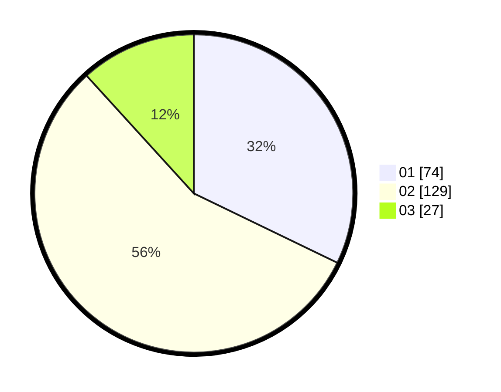

# Hasil

Hasil perolehan suara paslon dapat dilihat pada file paslon-01.txt, paslon-02.txt, dan paslon-03.txt.

Jika tidak ada, artinya data tersebut belum ada pada SIREKAP.

## Perolehan Suara

 * Paslon 01: **74**.
 * Paslon 02: **129**.
 * Paslon 03: **27**.

## Foto C Plano

https://sirekap-obj-formc.kpu.go.id/9617/pemilu/ppwp/31/75/07/10/01/3175071001010-20240214-210842--e1a5199c-3d01-4f85-8588-506b3b31e7dd.jpg

https://sirekap-obj-formc.kpu.go.id/9617/pemilu/ppwp/31/75/07/10/01/3175071001010-20240214-210958--772b56be-7b47-4e2f-864d-aa5ac5d3463c.jpg

https://sirekap-obj-formc.kpu.go.id/9617/pemilu/ppwp/31/75/07/10/01/3175071001010-20240214-211105--6ac554c3-fd9b-4762-ad88-ff9e712727fa.jpg
