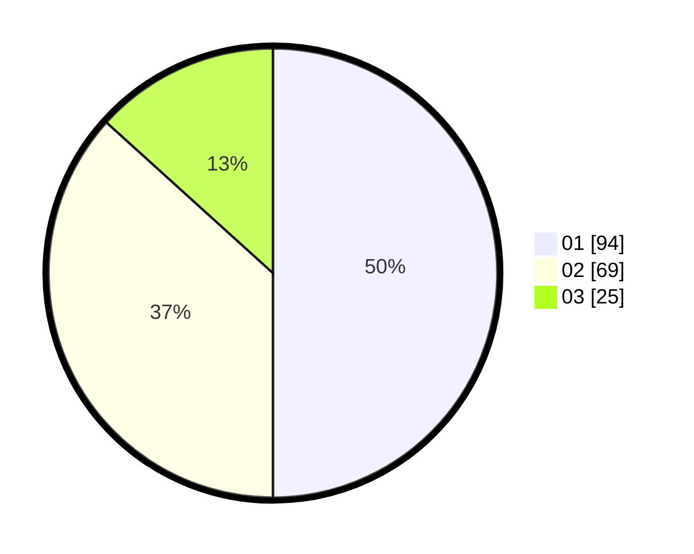

# Hasil

Hasil perolehan suara paslon dapat dilihat pada file paslon-01.txt, paslon-02.txt, dan paslon-03.txt.

Jika tidak ada, artinya data tersebut belum ada pada SIREKAP.

## Perolehan Suara

 * Paslon 01: **94**.
 * Paslon 02: **69**.
 * Paslon 03: **25**.

## Foto C Plano

https://sirekap-obj-formc.kpu.go.id/c3c2/pemilu/ppwp/31/75/07/10/01/3175071001029-20240216-104403--d6cfb7e5-181f-41f3-af08-a6ebbde440d7.jpg

https://sirekap-obj-formc.kpu.go.id/c3c2/pemilu/ppwp/31/75/07/10/01/3175071001029-20240214-194214--8aa50c85-753e-44da-aaaa-d3cb5ab5e3ea.jpg

https://sirekap-obj-formc.kpu.go.id/c3c2/pemilu/ppwp/31/75/07/10/01/3175071001029-20240214-194328--17f5587c-fe01-4a77-8044-44bbff51ea74.jpg

## DATA PEMILIH TETAP

Jumlah pemilih dalam DPT: **251**.
 * L: **129**.
 * P: **122**.

## DATA PENGGUNA HAK PILIH

Jumlah pengguna hak pilih dalam DPT: **188**.
 * L: **93**.
 * P: **95**.

Jumlah pengguna hak pilih dalam DPTb: **0**.
 * L: **0**.
 * P: **0**.

Jumlah pengguna hak pilih dalam DPK: **1**.
 * L: **0**.
 * P: **1**.

Jumlah pengguna hak pilih: **189**.
 * L: **93**.
 * P: **96**.

## JUMLAH SUARA SAH DAN TIDAK SAH

JUMLAH SELURUH SUARA SAH: **188**.

JUMLAH SUARA TIDAK SAH: **1**.

JUMLAH SELURUH SUARA SAH DAN SUARA TIDAK SAH: **189**.
