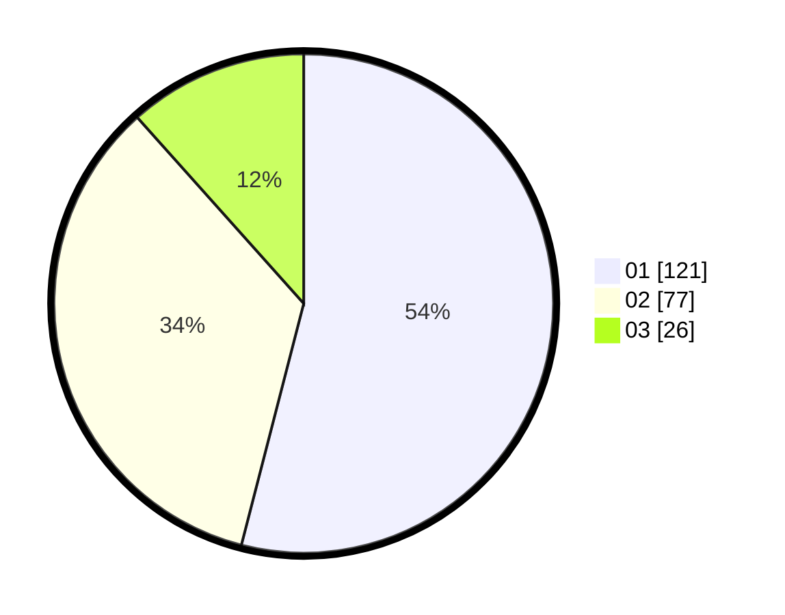

# Hasil

Hasil perolehan suara paslon dapat dilihat pada file paslon-01.txt, paslon-02.txt, dan paslon-03.txt.

Jika tidak ada, artinya data tersebut belum ada pada SIREKAP.

## Perolehan Suara

 * Paslon 01: **121**.
 * Paslon 02: **77**.
 * Paslon 03: **26**.

## Foto C Plano

https://sirekap-obj-formc.kpu.go.id/f049/pemilu/ppwp/31/75/07/10/01/3175071001038-20240214-191145--32e088ee-5658-47e7-99e3-d2150f416416.jpg

https://sirekap-obj-formc.kpu.go.id/f049/pemilu/ppwp/31/75/07/10/01/3175071001038-20240214-155552--62923200-574b-4830-83d8-7e2c700bbedc.jpg

https://sirekap-obj-formc.kpu.go.id/f049/pemilu/ppwp/31/75/07/10/01/3175071001038-20240214-191153--fad0f09f-bee4-4c1e-8b92-2ea0dad770ed.jpg

## DATA PEMILIH TETAP

Jumlah pemilih dalam DPT: **271**.
 * L: **128**.
 * P: **143**.

## DATA PENGGUNA HAK PILIH

Jumlah pengguna hak pilih dalam DPT: **224**.
 * L: **102**.
 * P: **122**.

Jumlah pengguna hak pilih dalam DPTb: **0**.
 * L: **0**.
 * P: **0**.

Jumlah pengguna hak pilih dalam DPK: **0**.
 * L: **0**.
 * P: **0**.

Jumlah pengguna hak pilih: **224**.
 * L: **102**.
 * P: **122**.

## JUMLAH SUARA SAH DAN TIDAK SAH

JUMLAH SELURUH SUARA SAH: **224**.

JUMLAH SUARA TIDAK SAH: **0**.

JUMLAH SELURUH SUARA SAH DAN SUARA TIDAK SAH: **224**.
