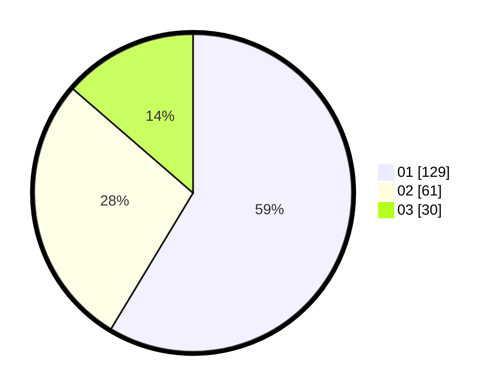

# Hasil

Hasil perolehan suara paslon dapat dilihat pada file paslon-01.txt, paslon-02.txt, dan paslon-03.txt.

Jika tidak ada, artinya data tersebut belum ada pada SIREKAP.

## Perolehan Suara

 * Paslon 01: **129**.
 * Paslon 02: **61**.
 * Paslon 03: **30**.

## Foto C Plano

https://sirekap-obj-formc.kpu.go.id/a716/pemilu/ppwp/31/75/07/10/01/3175071001042-20240215-193807--5a748734-29ab-473f-8a6c-56f7da7d61f7.jpg

https://sirekap-obj-formc.kpu.go.id/a716/pemilu/ppwp/31/75/07/10/01/3175071001042-20240215-193818--5adf7869-12d1-4efb-b0c4-00c1bc72acab.jpg

https://sirekap-obj-formc.kpu.go.id/a716/pemilu/ppwp/31/75/07/10/01/3175071001042-20240215-193823--0558a26c-f150-475e-986e-958d2db881fa.jpg

## DATA PEMILIH TETAP

Jumlah pemilih dalam DPT: **265**.
 * L: **128**.
 * P: **137**.

## DATA PENGGUNA HAK PILIH

Jumlah pengguna hak pilih dalam DPT: **220**.
 * L: **104**.
 * P: **116**.

Jumlah pengguna hak pilih dalam DPTb: **2**.
 * L: **1**.
 * P: **1**.

Jumlah pengguna hak pilih dalam DPK: **0**.
 * L: **0**.
 * P: **0**.

Jumlah pengguna hak pilih: **222**.
 * L: **105**.
 * P: **117**.

## JUMLAH SUARA SAH DAN TIDAK SAH

JUMLAH SELURUH SUARA SAH: **220**.

JUMLAH SUARA TIDAK SAH: **2**.

JUMLAH SELURUH SUARA SAH DAN SUARA TIDAK SAH: **222**.
