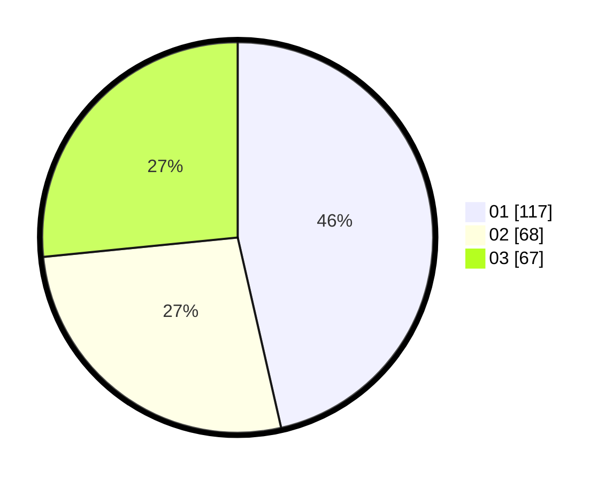

# Hasil

Hasil perolehan suara paslon dapat dilihat pada file paslon-01.txt, paslon-02.txt, dan paslon-03.txt.

Jika tidak ada, artinya data tersebut belum ada pada SIREKAP.

## Perolehan Suara

 * Paslon 01: **117**.
 * Paslon 02: **68**.
 * Paslon 03: **67**.

## Foto C Plano

https://sirekap-obj-formc.kpu.go.id/e378/pemilu/ppwp/31/75/07/10/01/3175071001045-20240214-211936--9a98f24d-3c2b-4e78-9385-a6ec94094d73.jpg

https://sirekap-obj-formc.kpu.go.id/e378/pemilu/ppwp/31/75/07/10/01/3175071001045-20240214-212040--e03b729f-3433-45f3-9740-b341ee1a861d.jpg

https://sirekap-obj-formc.kpu.go.id/e378/pemilu/ppwp/31/75/07/10/01/3175071001045-20240214-212122--4cd1090e-4a5c-4d03-a841-cedea64250fe.jpg
