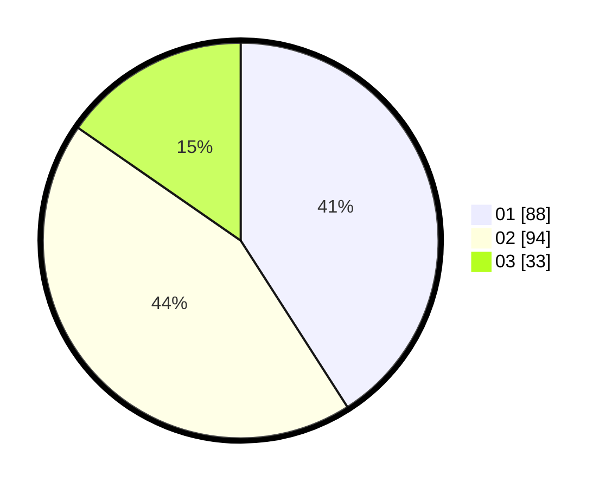

# Hasil

Hasil perolehan suara paslon dapat dilihat pada file paslon-01.txt, paslon-02.txt, dan paslon-03.txt.

Jika tidak ada, artinya data tersebut belum ada pada SIREKAP.

## Perolehan Suara

 * Paslon 01: **88**.
 * Paslon 02: **94**.
 * Paslon 03: **33**.

## Foto C Plano

https://sirekap-obj-formc.kpu.go.id/aea4/pemilu/ppwp/31/75/07/10/01/3175071001049-20240215-031949--d57d8a6d-360f-4f42-9898-caff709142c3.jpg

https://sirekap-obj-formc.kpu.go.id/aea4/pemilu/ppwp/31/75/07/10/01/3175071001049-20240215-032020--1498107d-b522-4b46-82d6-9323aa1d7abc.jpg

https://sirekap-obj-formc.kpu.go.id/aea4/pemilu/ppwp/31/75/07/10/01/3175071001049-20240214-222601--4f81eb61-09c6-44a5-a428-93c813de559a.jpg
