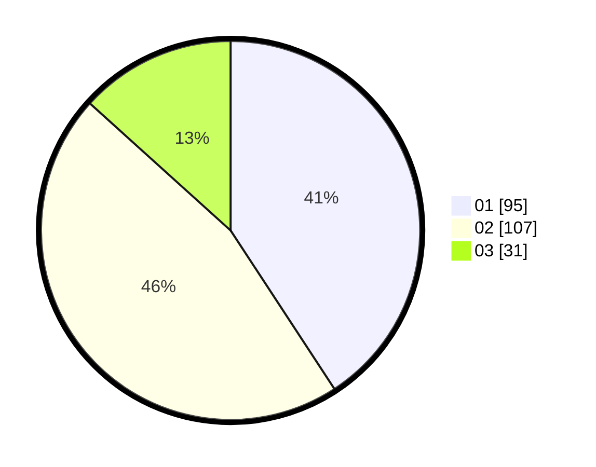

# Hasil

Hasil perolehan suara paslon dapat dilihat pada file paslon-01.txt, paslon-02.txt, dan paslon-03.txt.

Jika tidak ada, artinya data tersebut belum ada pada SIREKAP.

## Perolehan Suara

 * Paslon 01: **95**.
 * Paslon 02: **107**.
 * Paslon 03: **31**.

## Foto C Plano

https://sirekap-obj-formc.kpu.go.id/0484/pemilu/ppwp/31/75/07/10/01/3175071001050-20240214-162222--b4a92f97-f4ba-4e9d-8a74-8343b6ec4c05.jpg

https://sirekap-obj-formc.kpu.go.id/0484/pemilu/ppwp/31/75/07/10/01/3175071001050-20240214-162235--698411f9-067e-4120-b262-dc9c2aa5a2e8.jpg

https://sirekap-obj-formc.kpu.go.id/0484/pemilu/ppwp/31/75/07/10/01/3175071001050-20240214-162242--d64d504c-a45c-42cc-b451-6877856a0fee.jpg

## DATA PEMILIH TETAP

Jumlah pemilih dalam DPT: **283**.
 * L: **152**.
 * P: **131**.

## DATA PENGGUNA HAK PILIH

Jumlah pengguna hak pilih dalam DPT: **233**.
 * L: **122**.
 * P: **111**.

Jumlah pengguna hak pilih dalam DPTb: **0**.
 * L: **0**.
 * P: **0**.

Jumlah pengguna hak pilih dalam DPK: **1**.
 * L: **0**.
 * P: **1**.

Jumlah pengguna hak pilih: **234**.
 * L: **122**.
 * P: **112**.

## JUMLAH SUARA SAH DAN TIDAK SAH

JUMLAH SELURUH SUARA SAH: **233**.

JUMLAH SUARA TIDAK SAH: **1**.

JUMLAH SELURUH SUARA SAH DAN SUARA TIDAK SAH: **234**.
