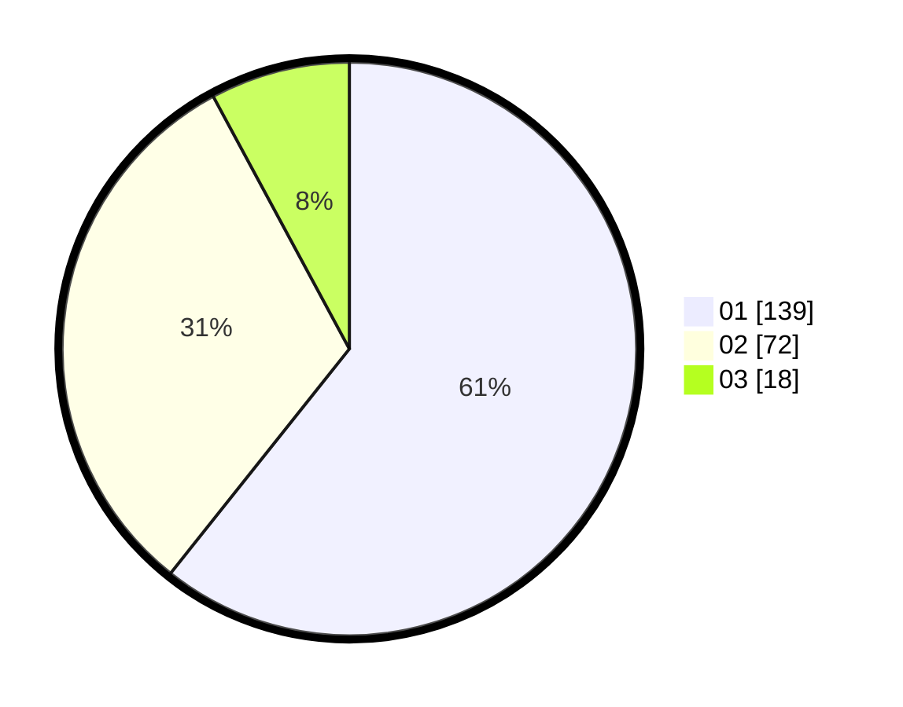

# Hasil

Hasil perolehan suara paslon dapat dilihat pada file paslon-01.txt, paslon-02.txt, dan paslon-03.txt.

Jika tidak ada, artinya data tersebut belum ada pada SIREKAP.

## Perolehan Suara

 * Paslon 01: **139**.
 * Paslon 02: **72**.
 * Paslon 03: **18**.

## Foto C Plano

https://sirekap-obj-formc.kpu.go.id/43c8/pemilu/ppwp/31/75/07/10/01/3175071001053-20240214-155044--652a4fea-11ee-4e74-802d-71bc7150065a.jpg

https://sirekap-obj-formc.kpu.go.id/43c8/pemilu/ppwp/31/75/07/10/01/3175071001053-20240214-193036--02420b2e-4469-47b1-bfed-518515e1ba9d.jpg

https://sirekap-obj-formc.kpu.go.id/43c8/pemilu/ppwp/31/75/07/10/01/3175071001053-20240214-155128--1dc6261a-4c8f-4868-8edd-da4097d50559.jpg

## DATA PEMILIH TETAP

Jumlah pemilih dalam DPT: **225**.
 * L: **112**.
 * P: **113**.

## DATA PENGGUNA HAK PILIH

Jumlah pengguna hak pilih dalam DPT: **225**.
 * L: **112**.
 * P: **113**.

Jumlah pengguna hak pilih dalam DPTb: **2**.
 * L: **1**.
 * P: **1**.

Jumlah pengguna hak pilih dalam DPK: **2**.
 * L: **1**.
 * P: **1**.

Jumlah pengguna hak pilih: **229**.
 * L: **114**.
 * P: **115**.

## JUMLAH SUARA SAH DAN TIDAK SAH

JUMLAH SELURUH SUARA SAH: **229**.

JUMLAH SUARA TIDAK SAH: **0**.

JUMLAH SELURUH SUARA SAH DAN SUARA TIDAK SAH: **229**.
