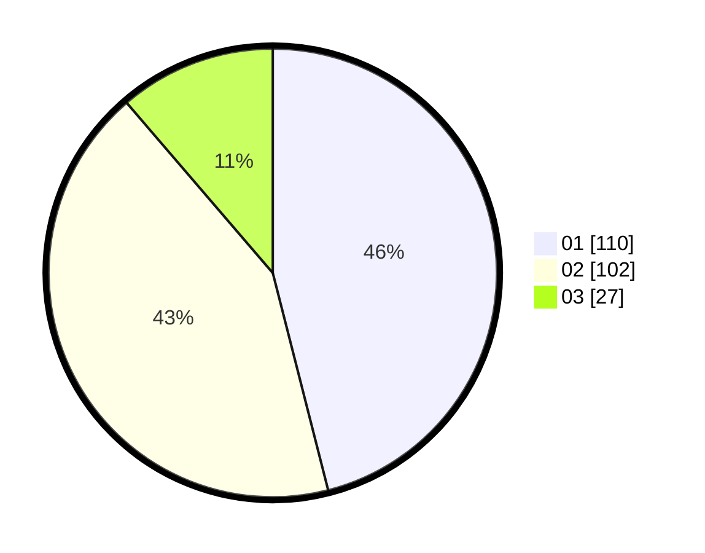

# Hasil

Hasil perolehan suara paslon dapat dilihat pada file paslon-01.txt, paslon-02.txt, dan paslon-03.txt.

Jika tidak ada, artinya data tersebut belum ada pada SIREKAP.

## Perolehan Suara

 * Paslon 01: **110**.
 * Paslon 02: **102**.
 * Paslon 03: **27**.

## Foto C Plano

https://sirekap-obj-formc.kpu.go.id/7ab2/pemilu/ppwp/31/75/07/10/01/3175071001056-20240216-001841--4db44bf4-5a78-4e09-86cd-0e5be3c803ad.jpg

https://sirekap-obj-formc.kpu.go.id/7ab2/pemilu/ppwp/31/75/07/10/01/3175071001056-20240216-001844--2a4b1e7f-4ba2-460d-b0e8-4154482c0b38.jpg

https://sirekap-obj-formc.kpu.go.id/7ab2/pemilu/ppwp/31/75/07/10/01/3175071001056-20240216-001843--0a68db07-ade8-4fe1-83cc-354fc5163391.jpg

## DATA PEMILIH TETAP

Jumlah pemilih dalam DPT: **262**.
 * L: **131**.
 * P: **131**.

## DATA PENGGUNA HAK PILIH

Jumlah pengguna hak pilih dalam DPT: **235**.
 * L: **115**.
 * P: **120**.

Jumlah pengguna hak pilih dalam DPTb: **2**.
 * L: **0**.
 * P: **2**.

Jumlah pengguna hak pilih dalam DPK: **4**.
 * L: **1**.
 * P: **3**.

Jumlah pengguna hak pilih: **241**.
 * L: **116**.
 * P: **125**.

## JUMLAH SUARA SAH DAN TIDAK SAH

JUMLAH SELURUH SUARA SAH: **239**.

JUMLAH SUARA TIDAK SAH: **2**.

JUMLAH SELURUH SUARA SAH DAN SUARA TIDAK SAH: **241**.
