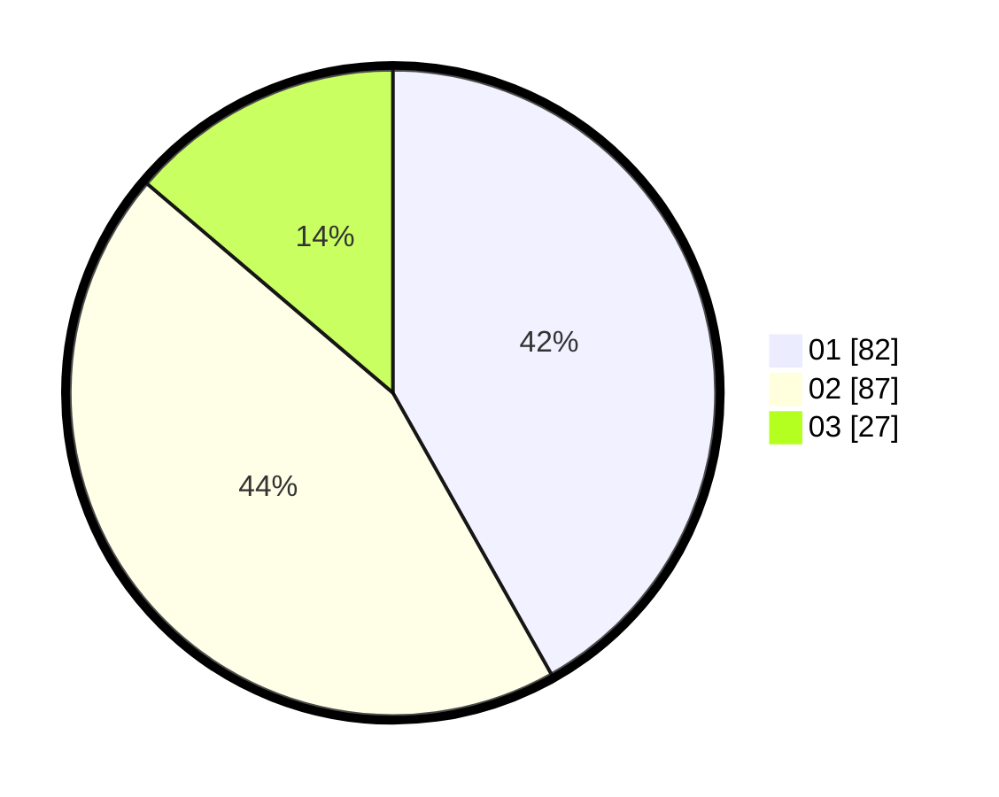

# Hasil

Hasil perolehan suara paslon dapat dilihat pada file paslon-01.txt, paslon-02.txt, dan paslon-03.txt.

Jika tidak ada, artinya data tersebut belum ada pada SIREKAP.

## Perolehan Suara

 * Paslon 01: **82**.
 * Paslon 02: **87**.
 * Paslon 03: **27**.

## Foto C Plano

https://sirekap-obj-formc.kpu.go.id/61f0/pemilu/ppwp/31/75/07/10/01/3175071001060-20240215-021403--6db2f6ab-3a06-4abe-8892-f2e4616f7a04.jpg

https://sirekap-obj-formc.kpu.go.id/61f0/pemilu/ppwp/31/75/07/10/01/3175071001060-20240215-021511--903005bf-878b-41ba-a001-8eb98a81097a.jpg

https://sirekap-obj-formc.kpu.go.id/61f0/pemilu/ppwp/31/75/07/10/01/3175071001060-20240215-021600--72666ac7-8588-407b-86f8-2146595c621c.jpg
