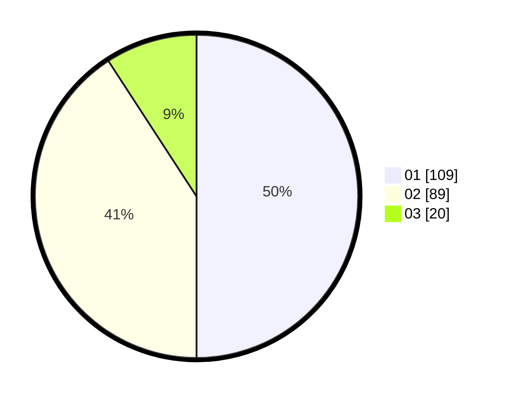

# Hasil

Hasil perolehan suara paslon dapat dilihat pada file paslon-01.txt, paslon-02.txt, dan paslon-03.txt.

Jika tidak ada, artinya data tersebut belum ada pada SIREKAP.

## Perolehan Suara

 * Paslon 01: **109**.
 * Paslon 02: **89**.
 * Paslon 03: **20**.

## Foto C Plano

https://sirekap-obj-formc.kpu.go.id/51ba/pemilu/ppwp/31/75/07/10/01/3175071001070-20240214-193708--d0178dd8-7fae-4994-b583-3a782c84f835.jpg

https://sirekap-obj-formc.kpu.go.id/51ba/pemilu/ppwp/31/75/07/10/01/3175071001070-20240214-193736--750d2d42-c544-480e-976f-aa699af3410b.jpg

https://sirekap-obj-formc.kpu.go.id/51ba/pemilu/ppwp/31/75/07/10/01/3175071001070-20240214-184455--778d24b8-0cff-41df-a4e1-e27a7460260f.jpg

## DATA PEMILIH TETAP

Jumlah pemilih dalam DPT: **265**.
 * L: **135**.
 * P: **130**.

## DATA PENGGUNA HAK PILIH

Jumlah pengguna hak pilih dalam DPT: **213**.
 * L: **104**.
 * P: **109**.

Jumlah pengguna hak pilih dalam DPTb: **0**.
 * L: **0**.
 * P: **0**.

Jumlah pengguna hak pilih dalam DPK: **7**.
 * L: **3**.
 * P: **4**.

Jumlah pengguna hak pilih: **220**.
 * L: **107**.
 * P: **113**.

## JUMLAH SUARA SAH DAN TIDAK SAH

JUMLAH SELURUH SUARA SAH: **218**.

JUMLAH SUARA TIDAK SAH: **2**.

JUMLAH SELURUH SUARA SAH DAN SUARA TIDAK SAH: **220**.
