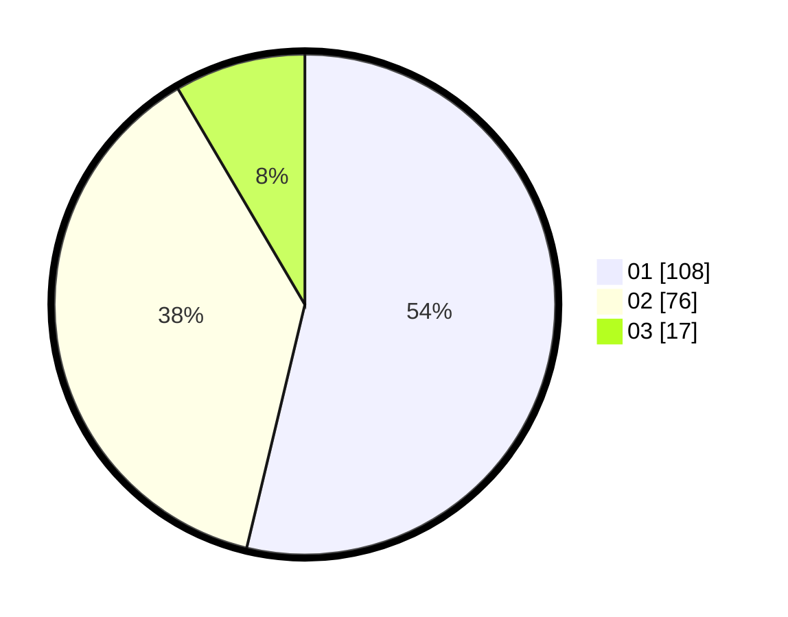

# Hasil

Hasil perolehan suara paslon dapat dilihat pada file paslon-01.txt, paslon-02.txt, dan paslon-03.txt.

Jika tidak ada, artinya data tersebut belum ada pada SIREKAP.

## Perolehan Suara

 * Paslon 01: **108**.
 * Paslon 02: **76**.
 * Paslon 03: **17**.

## Foto C Plano

https://sirekap-obj-formc.kpu.go.id/fb1b/pemilu/ppwp/31/75/07/10/01/3175071001071-20240214-202853--708882cf-6a39-41af-8e4e-b75aea8f92e5.jpg

https://sirekap-obj-formc.kpu.go.id/fb1b/pemilu/ppwp/31/75/07/10/01/3175071001071-20240214-202642--ef9c0d57-ab17-49cf-b6db-d26781aaa95b.jpg

https://sirekap-obj-formc.kpu.go.id/fb1b/pemilu/ppwp/31/75/07/10/01/3175071001071-20240214-194904--c8a34e13-176b-4694-b910-ee4ee3b4d1f3.jpg

## DATA PEMILIH TETAP

Jumlah pemilih dalam DPT: **255**.
 * L: **118**.
 * P: **137**.

## DATA PENGGUNA HAK PILIH

Jumlah pengguna hak pilih dalam DPT: **203**.
 * L: **90**.
 * P: **113**.

Jumlah pengguna hak pilih dalam DPTb: **0**.
 * L: **0**.
 * P: **0**.

Jumlah pengguna hak pilih dalam DPK: **0**.
 * L: **0**.
 * P: **0**.

Jumlah pengguna hak pilih: **203**.
 * L: **90**.
 * P: **113**.

## JUMLAH SUARA SAH DAN TIDAK SAH

JUMLAH SELURUH SUARA SAH: **201**.

JUMLAH SUARA TIDAK SAH: **2**.

JUMLAH SELURUH SUARA SAH DAN SUARA TIDAK SAH: **203**.
