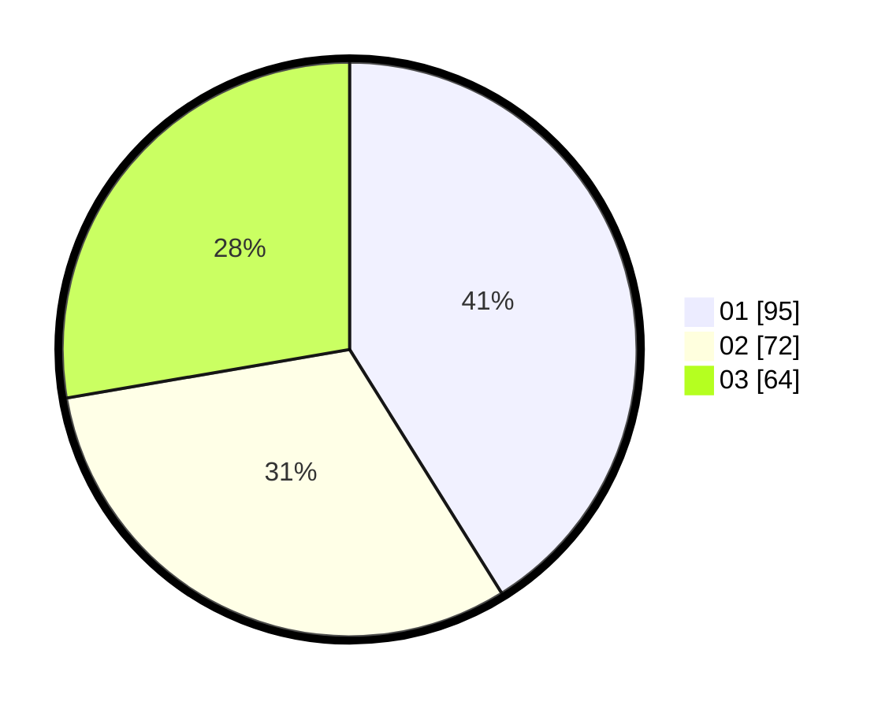

# Hasil

Hasil perolehan suara paslon dapat dilihat pada file paslon-01.txt, paslon-02.txt, dan paslon-03.txt.

Jika tidak ada, artinya data tersebut belum ada pada SIREKAP.

## Perolehan Suara

 * Paslon 01: **95**.
 * Paslon 02: **72**.
 * Paslon 03: **64**.

## Foto C Plano

https://sirekap-obj-formc.kpu.go.id/a914/pemilu/ppwp/31/75/07/10/01/3175071001076-20240214-232609--1d1f4154-87b5-4c14-8109-96c8848fe824.jpg

https://sirekap-obj-formc.kpu.go.id/a914/pemilu/ppwp/31/75/07/10/01/3175071001076-20240214-232646--a1819406-e541-477a-a5ce-f218b72b7e17.jpg

https://sirekap-obj-formc.kpu.go.id/a914/pemilu/ppwp/31/75/07/10/01/3175071001076-20240214-232713--5d3d21ab-2d8c-463c-b335-7ee991f50389.jpg
