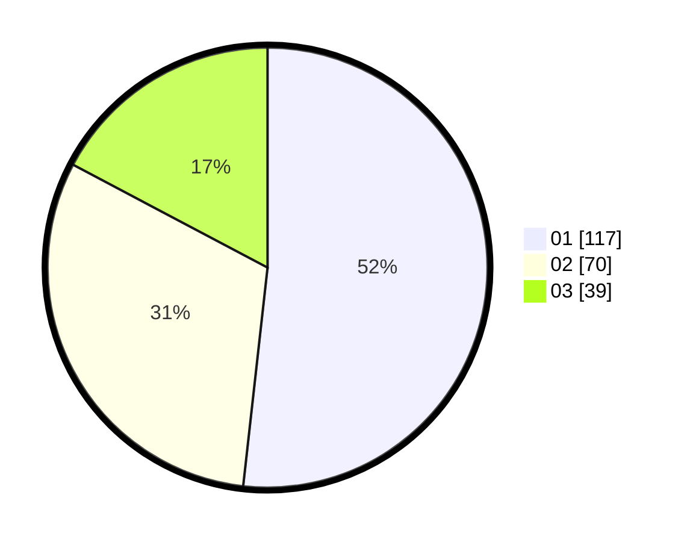

# Hasil

Hasil perolehan suara paslon dapat dilihat pada file paslon-01.txt, paslon-02.txt, dan paslon-03.txt.

Jika tidak ada, artinya data tersebut belum ada pada SIREKAP.

## Perolehan Suara

 * Paslon 01: **117**.
 * Paslon 02: **70**.
 * Paslon 03: **39**.

## Foto C Plano

https://sirekap-obj-formc.kpu.go.id/399f/pemilu/ppwp/31/75/07/10/01/3175071001079-20240214-155601--d6c30851-3920-4649-9b70-2a72299b7828.jpg

https://sirekap-obj-formc.kpu.go.id/399f/pemilu/ppwp/31/75/07/10/01/3175071001079-20240214-155746--ab4c70e5-6321-455c-975e-e6e5ba925fb0.jpg

https://sirekap-obj-formc.kpu.go.id/399f/pemilu/ppwp/31/75/07/10/01/3175071001079-20240216-053516--da6e18d9-b286-4ecc-ae4e-fdc6f44b43bd.jpg

## DATA PEMILIH TETAP

Jumlah pemilih dalam DPT: **269**.
 * L: **124**.
 * P: **145**.

## DATA PENGGUNA HAK PILIH

Jumlah pengguna hak pilih dalam DPT: **227**.
 * L: **102**.
 * P: **125**.

Jumlah pengguna hak pilih dalam DPTb: **1**.
 * L: **1**.
 * P: **0**.

Jumlah pengguna hak pilih dalam DPK: **2**.
 * L: **0**.
 * P: **2**.

Jumlah pengguna hak pilih: **230**.
 * L: **103**.
 * P: **127**.

## JUMLAH SUARA SAH DAN TIDAK SAH

JUMLAH SELURUH SUARA SAH: **226**.

JUMLAH SUARA TIDAK SAH: **4**.

JUMLAH SELURUH SUARA SAH DAN SUARA TIDAK SAH: **230**.
