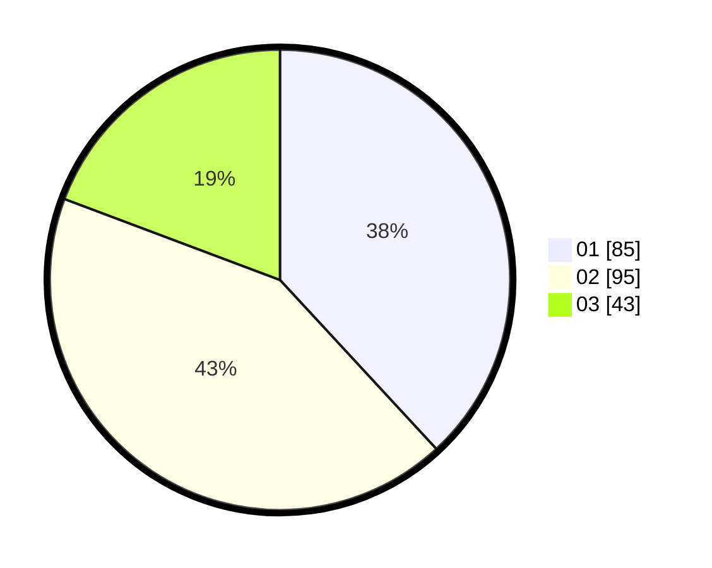

# Hasil

Hasil perolehan suara paslon dapat dilihat pada file paslon-01.txt, paslon-02.txt, dan paslon-03.txt.

Jika tidak ada, artinya data tersebut belum ada pada SIREKAP.

## Perolehan Suara

 * Paslon 01: **85**.
 * Paslon 02: **95**.
 * Paslon 03: **43**.

## Foto C Plano

https://sirekap-obj-formc.kpu.go.id/211b/pemilu/ppwp/31/75/07/10/01/3175071001080-20240216-155736--4ab67f01-9f0d-42ef-bb90-696f08585abb.jpg

https://sirekap-obj-formc.kpu.go.id/211b/pemilu/ppwp/31/75/07/10/01/3175071001080-20240216-155737--a3960011-2fee-4728-8b7b-d4f67c71cf36.jpg

https://sirekap-obj-formc.kpu.go.id/211b/pemilu/ppwp/31/75/07/10/01/3175071001080-20240216-155737--db0b5e08-1052-4c42-8c89-21044e85568b.jpg

## DATA PEMILIH TETAP

Jumlah pemilih dalam DPT: **272**.
 * L: **133**.
 * P: **139**.

## DATA PENGGUNA HAK PILIH

Jumlah pengguna hak pilih dalam DPT: **224**.
 * L: **104**.
 * P: **120**.

Jumlah pengguna hak pilih dalam DPTb: **2**.
 * L: **1**.
 * P: **1**.

Jumlah pengguna hak pilih dalam DPK: **1**.
 * L: **0**.
 * P: **1**.

Jumlah pengguna hak pilih: **227**.
 * L: **105**.
 * P: **122**.

## JUMLAH SUARA SAH DAN TIDAK SAH

JUMLAH SELURUH SUARA SAH: **223**.

JUMLAH SUARA TIDAK SAH: **4**.

JUMLAH SELURUH SUARA SAH DAN SUARA TIDAK SAH: **227**.
