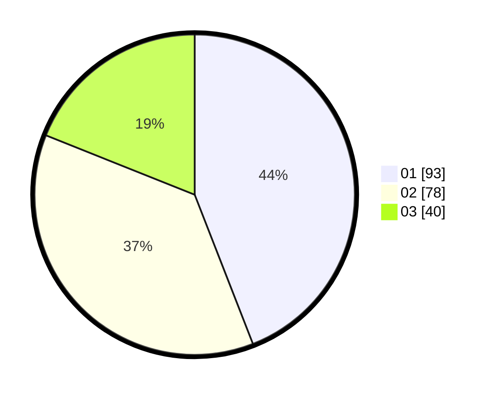

# Hasil

Hasil perolehan suara paslon dapat dilihat pada file paslon-01.txt, paslon-02.txt, dan paslon-03.txt.

Jika tidak ada, artinya data tersebut belum ada pada SIREKAP.

## Perolehan Suara

 * Paslon 01: **93**.
 * Paslon 02: **78**.
 * Paslon 03: **40**.

## Foto C Plano

https://sirekap-obj-formc.kpu.go.id/29e2/pemilu/ppwp/31/75/07/10/01/3175071001081-20240215-181459--f8a4d8f7-d765-4db6-b3ca-bbc659fe8b7d.jpg

https://sirekap-obj-formc.kpu.go.id/29e2/pemilu/ppwp/31/75/07/10/01/3175071001081-20240215-170856--ad669794-c0a5-43af-8269-14e64599bc88.jpg

https://sirekap-obj-formc.kpu.go.id/29e2/pemilu/ppwp/31/75/07/10/01/3175071001081-20240215-181622--2f99c469-fbe0-43b4-a076-c93669d40b47.jpg
