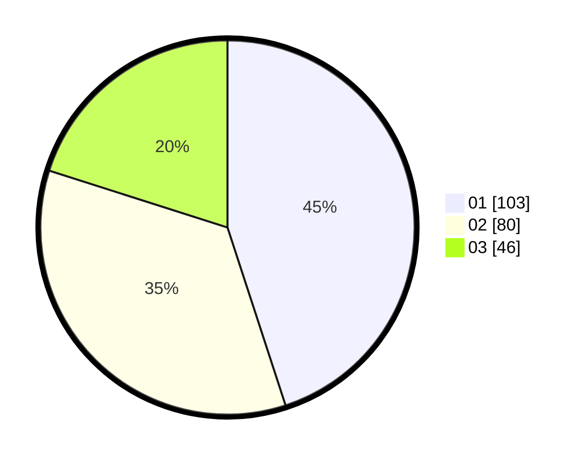

# Hasil

Hasil perolehan suara paslon dapat dilihat pada file paslon-01.txt, paslon-02.txt, dan paslon-03.txt.

Jika tidak ada, artinya data tersebut belum ada pada SIREKAP.

## Perolehan Suara

 * Paslon 01: **103**.
 * Paslon 02: **80**.
 * Paslon 03: **46**.

## Foto C Plano

https://sirekap-obj-formc.kpu.go.id/a8b3/pemilu/ppwp/31/75/07/10/01/3175071001083-20240214-193324--ea7cf7eb-c340-44fa-9eb7-01dab01d9f9d.jpg

https://sirekap-obj-formc.kpu.go.id/a8b3/pemilu/ppwp/31/75/07/10/01/3175071001083-20240214-193600--953489c9-aa9c-48e7-97ad-fd36d2ddd7a1.jpg

https://sirekap-obj-formc.kpu.go.id/a8b3/pemilu/ppwp/31/75/07/10/01/3175071001083-20240214-193813--06b4c479-db64-47df-bff6-5f3097f4b1d7.jpg

## DATA PEMILIH TETAP

Jumlah pemilih dalam DPT: **227**.
 * L: **133**.
 * P: **142**.

## DATA PENGGUNA HAK PILIH

Jumlah pengguna hak pilih dalam DPT: **227**.
 * L: **109**.
 * P: **118**.

Jumlah pengguna hak pilih dalam DPTb: **3**.
 * L: **0**.
 * P: **3**.

Jumlah pengguna hak pilih dalam DPK: **2**.
 * L: **1**.
 * P: **1**.

Jumlah pengguna hak pilih: **232**.
 * L: **110**.
 * P: **122**.

## JUMLAH SUARA SAH DAN TIDAK SAH

JUMLAH SELURUH SUARA SAH: **229**.

JUMLAH SUARA TIDAK SAH: **3**.

JUMLAH SELURUH SUARA SAH DAN SUARA TIDAK SAH: **232**.
