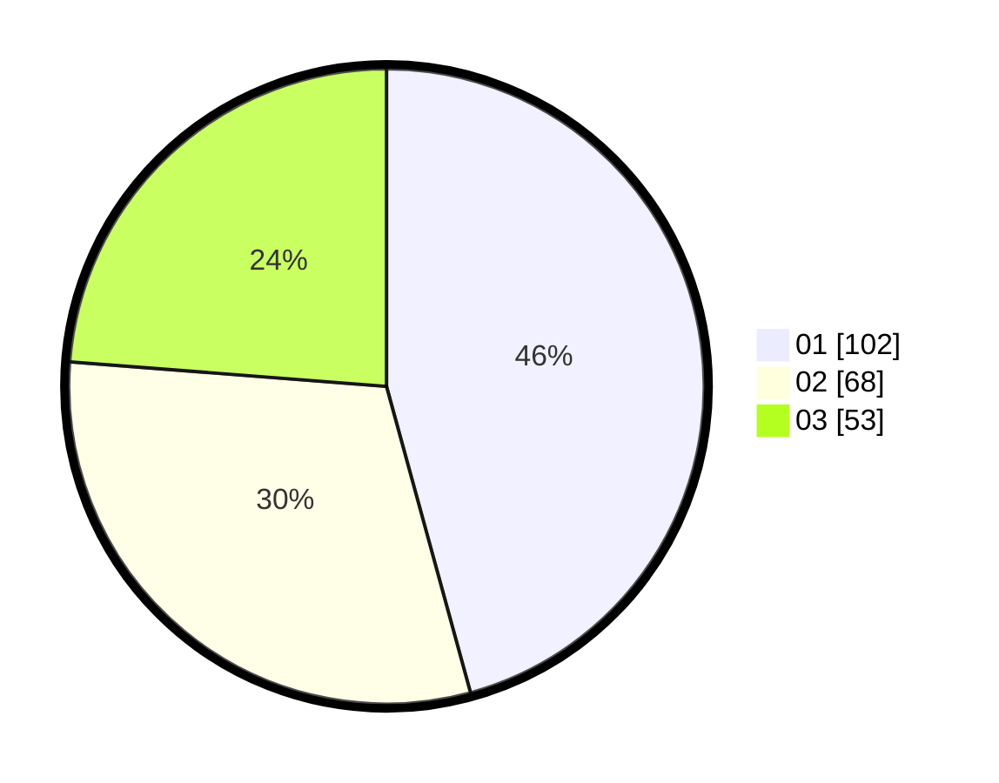

# Hasil

Hasil perolehan suara paslon dapat dilihat pada file paslon-01.txt, paslon-02.txt, dan paslon-03.txt.

Jika tidak ada, artinya data tersebut belum ada pada SIREKAP.

## Perolehan Suara

 * Paslon 01: **102**.
 * Paslon 02: **68**.
 * Paslon 03: **53**.

## Foto C Plano

https://sirekap-obj-formc.kpu.go.id/70d1/pemilu/ppwp/31/75/07/10/01/3175071001084-20240216-150514--8877360a-7abd-42c8-a463-11dbc6935e61.jpg

https://sirekap-obj-formc.kpu.go.id/70d1/pemilu/ppwp/31/75/07/10/01/3175071001084-20240216-150515--177e83fd-1dba-4943-96c5-9b1f2734abf0.jpg

https://sirekap-obj-formc.kpu.go.id/70d1/pemilu/ppwp/31/75/07/10/01/3175071001084-20240216-150515--71045400-6d00-4fdf-a542-29b13a69d617.jpg

## DATA PEMILIH TETAP

Jumlah pemilih dalam DPT: **269**.
 * L: **120**.
 * P: **149**.

## DATA PENGGUNA HAK PILIH

Jumlah pengguna hak pilih dalam DPT: **222**.
 * L: **95**.
 * P: **127**.

Jumlah pengguna hak pilih dalam DPTb: **1**.
 * L: **0**.
 * P: **1**.

Jumlah pengguna hak pilih dalam DPK: **4**.
 * L: **1**.
 * P: **3**.

Jumlah pengguna hak pilih: **227**.
 * L: **96**.
 * P: **131**.

## JUMLAH SUARA SAH DAN TIDAK SAH

JUMLAH SELURUH SUARA SAH: **223**.

JUMLAH SUARA TIDAK SAH: **4**.

JUMLAH SELURUH SUARA SAH DAN SUARA TIDAK SAH: **227**.
