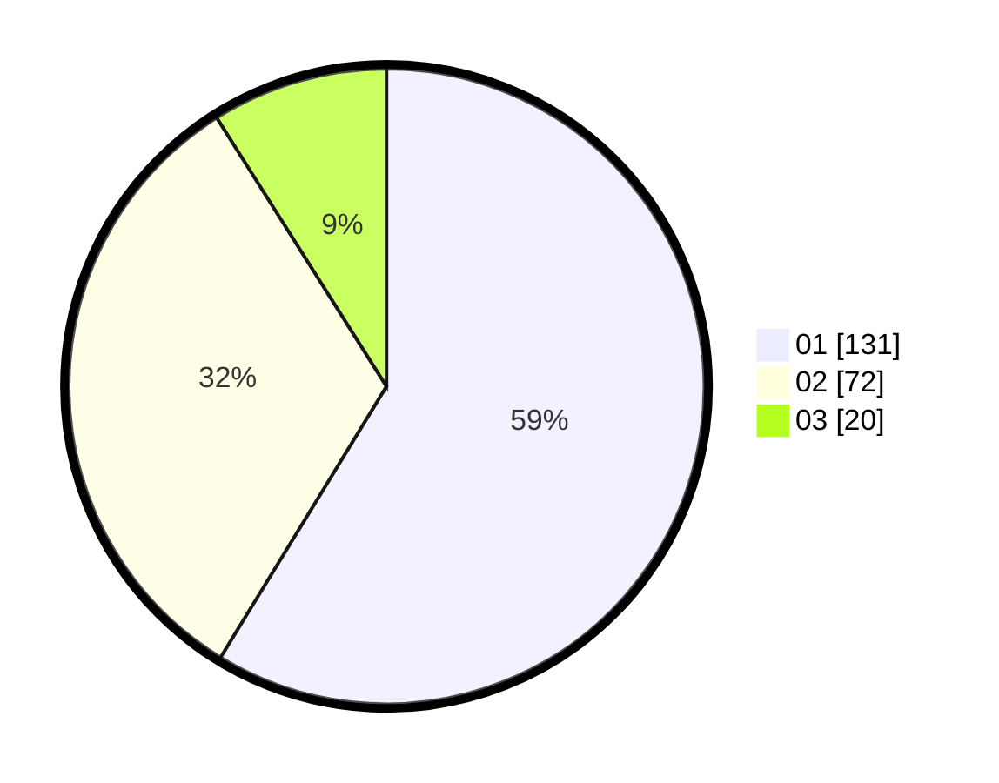

# Hasil

Hasil perolehan suara paslon dapat dilihat pada file paslon-01.txt, paslon-02.txt, dan paslon-03.txt.

Jika tidak ada, artinya data tersebut belum ada pada SIREKAP.

## Perolehan Suara

 * Paslon 01: **131**.
 * Paslon 02: **72**.
 * Paslon 03: **20**.

## Foto C Plano

https://sirekap-obj-formc.kpu.go.id/587a/pemilu/ppwp/31/75/07/10/01/3175071001087-20240214-210119--34020f57-fae7-486c-9ba8-a3d7d5fa2f01.jpg

https://sirekap-obj-formc.kpu.go.id/587a/pemilu/ppwp/31/75/07/10/01/3175071001087-20240215-015349--88de0e06-d21e-4a76-b0dd-38bbbda565a5.jpg

https://sirekap-obj-formc.kpu.go.id/587a/pemilu/ppwp/31/75/07/10/01/3175071001087-20240214-210450--06cae662-4ca6-404d-bfd7-7cce24362db4.jpg

## DATA PEMILIH TETAP

Jumlah pemilih dalam DPT: **270**.
 * L: **130**.
 * P: **140**.

## DATA PENGGUNA HAK PILIH

Jumlah pengguna hak pilih dalam DPT: **224**.
 * L: **108**.
 * P: **116**.

Jumlah pengguna hak pilih dalam DPTb: **0**.
 * L: **0**.
 * P: **0**.

Jumlah pengguna hak pilih dalam DPK: **0**.
 * L: **0**.
 * P: **0**.

Jumlah pengguna hak pilih: **224**.
 * L: **108**.
 * P: **116**.

## JUMLAH SUARA SAH DAN TIDAK SAH

JUMLAH SELURUH SUARA SAH: **223**.

JUMLAH SUARA TIDAK SAH: **1**.

JUMLAH SELURUH SUARA SAH DAN SUARA TIDAK SAH: **224**.
