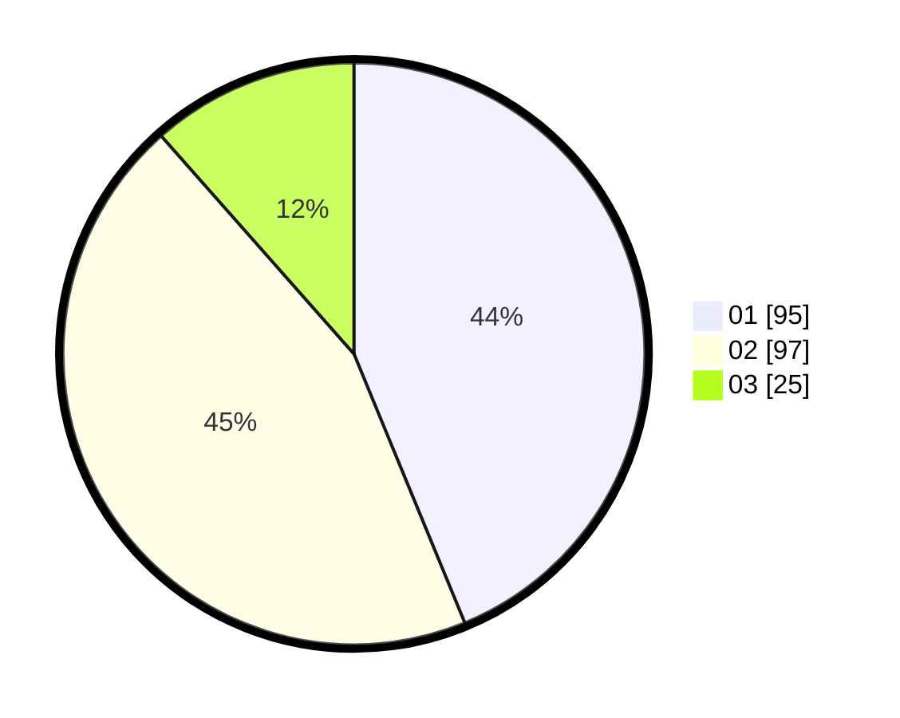

# Hasil

Hasil perolehan suara paslon dapat dilihat pada file paslon-01.txt, paslon-02.txt, dan paslon-03.txt.

Jika tidak ada, artinya data tersebut belum ada pada SIREKAP.

## Perolehan Suara

 * Paslon 01: **95**.
 * Paslon 02: **97**.
 * Paslon 03: **25**.

## Foto C Plano

https://sirekap-obj-formc.kpu.go.id/4ca4/pemilu/ppwp/31/75/07/10/01/3175071001097-20240214-185915--818ab152-c512-423b-9d4b-bafa525bb05a.jpg

https://sirekap-obj-formc.kpu.go.id/4ca4/pemilu/ppwp/31/75/07/10/01/3175071001097-20240214-190002--81465903-461f-4660-819c-f05ddb15a053.jpg

https://sirekap-obj-formc.kpu.go.id/4ca4/pemilu/ppwp/31/75/07/10/01/3175071001097-20240214-190042--acfb43b3-0022-4f62-8cb3-e4c77877ae94.jpg

## DATA PEMILIH TETAP

Jumlah pemilih dalam DPT: **270**.
 * L: **134**.
 * P: **136**.

## DATA PENGGUNA HAK PILIH

Jumlah pengguna hak pilih dalam DPT: **203**.
 * L: **101**.
 * P: **102**.

Jumlah pengguna hak pilih dalam DPTb: **0**.
 * L: **0**.
 * P: **0**.

Jumlah pengguna hak pilih dalam DPK: **14**.
 * L: **8**.
 * P: **6**.

Jumlah pengguna hak pilih: **217**.
 * L: **109**.
 * P: **108**.

## JUMLAH SUARA SAH DAN TIDAK SAH

JUMLAH SELURUH SUARA SAH: **217**.

JUMLAH SUARA TIDAK SAH: **0**.

JUMLAH SELURUH SUARA SAH DAN SUARA TIDAK SAH: **217**.
