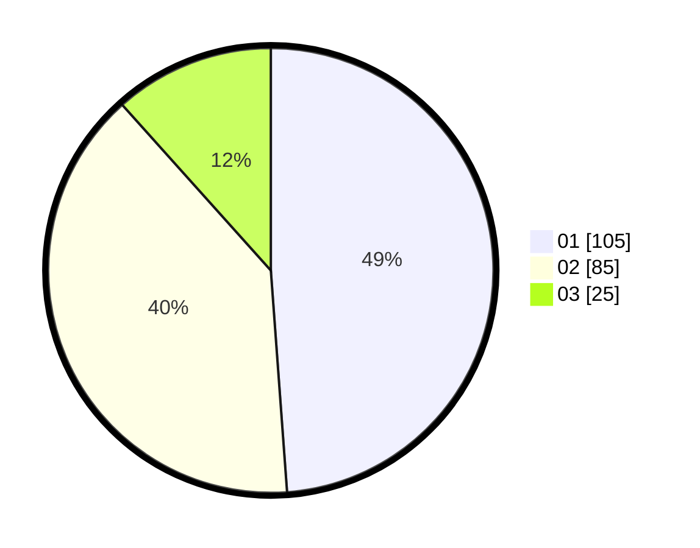

# Hasil

Hasil perolehan suara paslon dapat dilihat pada file paslon-01.txt, paslon-02.txt, dan paslon-03.txt.

Jika tidak ada, artinya data tersebut belum ada pada SIREKAP.

## Perolehan Suara

 * Paslon 01: **105**.
 * Paslon 02: **85**.
 * Paslon 03: **25**.

## Foto C Plano

https://sirekap-obj-formc.kpu.go.id/7112/pemilu/ppwp/31/75/07/10/01/3175071001105-20240216-132403--e7f290c4-633a-4fa9-b510-f03844a47370.jpg

https://sirekap-obj-formc.kpu.go.id/7112/pemilu/ppwp/31/75/07/10/01/3175071001105-20240216-132404--fdb64529-ec42-4f73-a4db-d928ac95ade0.jpg

https://sirekap-obj-formc.kpu.go.id/7112/pemilu/ppwp/31/75/07/10/01/3175071001105-20240216-132404--35a7aea5-c1da-46cd-93b4-d04fc1af82fe.jpg

## DATA PEMILIH TETAP

Jumlah pemilih dalam DPT: **274**.
 * L: **137**.
 * P: **137**.

## DATA PENGGUNA HAK PILIH

Jumlah pengguna hak pilih dalam DPT: **219**.
 * L: **102**.
 * P: **117**.

Jumlah pengguna hak pilih dalam DPTb: **0**.
 * L: **0**.
 * P: **0**.

Jumlah pengguna hak pilih dalam DPK: **0**.
 * L: **0**.
 * P: **0**.

Jumlah pengguna hak pilih: **219**.
 * L: **102**.
 * P: **117**.

## JUMLAH SUARA SAH DAN TIDAK SAH

JUMLAH SELURUH SUARA SAH: **215**.

JUMLAH SUARA TIDAK SAH: **4**.

JUMLAH SELURUH SUARA SAH DAN SUARA TIDAK SAH: **219**.
