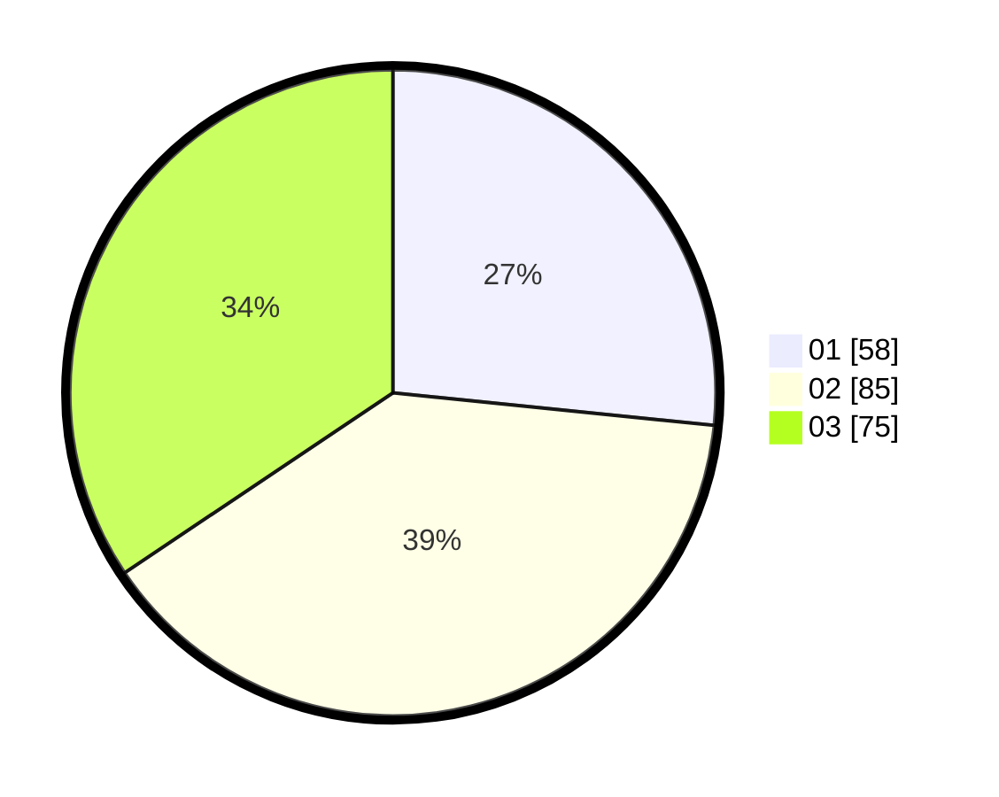

# Hasil

Hasil perolehan suara paslon dapat dilihat pada file paslon-01.txt, paslon-02.txt, dan paslon-03.txt.

Jika tidak ada, artinya data tersebut belum ada pada SIREKAP.

## Perolehan Suara

 * Paslon 01: **58**.
 * Paslon 02: **85**.
 * Paslon 03: **75**.

## Foto C Plano

https://sirekap-obj-formc.kpu.go.id/3ac7/pemilu/ppwp/31/75/07/10/01/3175071001109-20240215-025938--0088898a-cf8a-4deb-8850-78cae52326e2.jpg

https://sirekap-obj-formc.kpu.go.id/3ac7/pemilu/ppwp/31/75/07/10/01/3175071001109-20240214-213304--b1dc02eb-3620-40d7-a31d-7623481147fd.jpg

https://sirekap-obj-formc.kpu.go.id/3ac7/pemilu/ppwp/31/75/07/10/01/3175071001109-20240214-213406--8312f446-4659-413e-b517-3bf22bafbf5e.jpg
