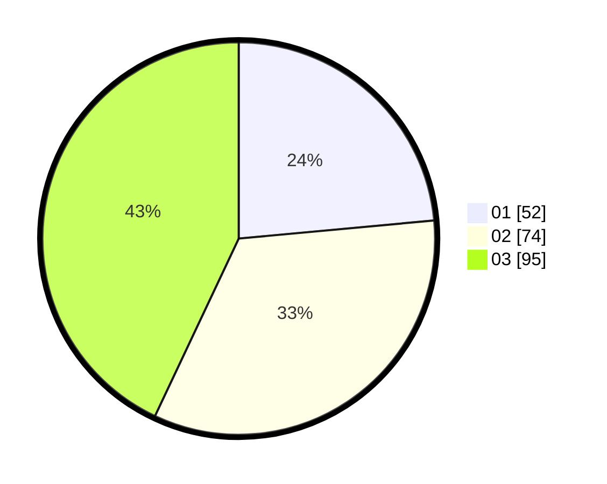

# Hasil

Hasil perolehan suara paslon dapat dilihat pada file paslon-01.txt, paslon-02.txt, dan paslon-03.txt.

Jika tidak ada, artinya data tersebut belum ada pada SIREKAP.

## Perolehan Suara

 * Paslon 01: **52**.
 * Paslon 02: **74**.
 * Paslon 03: **95**.

## Foto C Plano

https://sirekap-obj-formc.kpu.go.id/f929/pemilu/ppwp/31/75/07/10/01/3175071001110-20240215-133953--b18cdb42-685c-4710-a4fc-8a5d4602f585.jpg

https://sirekap-obj-formc.kpu.go.id/f929/pemilu/ppwp/31/75/07/10/01/3175071001110-20240215-134024--b36d242f-58b8-4f62-b95c-3a4dd0d750d3.jpg

https://sirekap-obj-formc.kpu.go.id/f929/pemilu/ppwp/31/75/07/10/01/3175071001110-20240215-134039--fb6eafd3-5299-4f75-af27-dc52d0c4f92d.jpg
