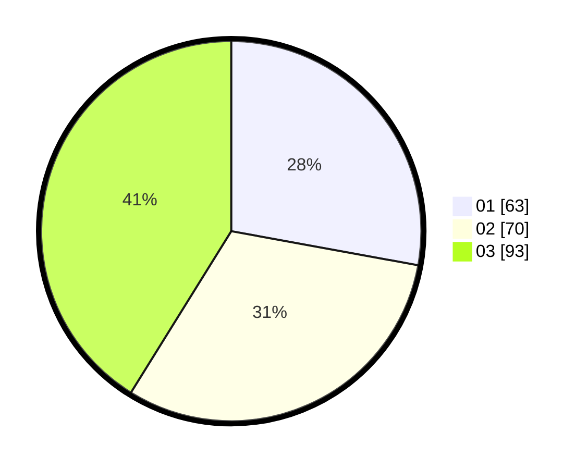

# Hasil

Hasil perolehan suara paslon dapat dilihat pada file paslon-01.txt, paslon-02.txt, dan paslon-03.txt.

Jika tidak ada, artinya data tersebut belum ada pada SIREKAP.

## Perolehan Suara

 * Paslon 01: **63**.
 * Paslon 02: **70**.
 * Paslon 03: **93**.

## Foto C Plano

https://sirekap-obj-formc.kpu.go.id/b0ae/pemilu/ppwp/31/75/07/10/01/3175071001112-20240214-155434--51cf6c38-e387-49d8-acfb-3cc7370b68e3.jpg

https://sirekap-obj-formc.kpu.go.id/b0ae/pemilu/ppwp/31/75/07/10/01/3175071001112-20240214-155538--6633d428-ddb1-4401-a696-f9acfd5c84b0.jpg

https://sirekap-obj-formc.kpu.go.id/b0ae/pemilu/ppwp/31/75/07/10/01/3175071001112-20240214-155637--f8eaaf40-4eef-46ea-9f26-9ec129a14862.jpg

## DATA PEMILIH TETAP

Jumlah pemilih dalam DPT: **273**.
 * L: **124**.
 * P: **149**.

## DATA PENGGUNA HAK PILIH

Jumlah pengguna hak pilih dalam DPT: **216**.
 * L: **98**.
 * P: **118**.

Jumlah pengguna hak pilih dalam DPTb: **9**.
 * L: **3**.
 * P: **6**.

Jumlah pengguna hak pilih dalam DPK: **3**.
 * L: **1**.
 * P: **2**.

Jumlah pengguna hak pilih: **228**.
 * L: **102**.
 * P: **126**.

## JUMLAH SUARA SAH DAN TIDAK SAH

JUMLAH SELURUH SUARA SAH: **226**.

JUMLAH SUARA TIDAK SAH: **2**.

JUMLAH SELURUH SUARA SAH DAN SUARA TIDAK SAH: **228**.
