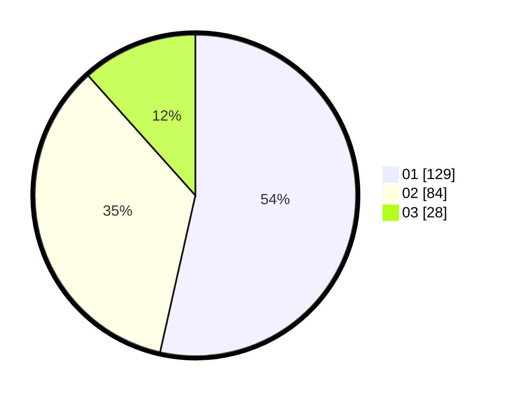

# Hasil

Hasil perolehan suara paslon dapat dilihat pada file paslon-01.txt, paslon-02.txt, dan paslon-03.txt.

Jika tidak ada, artinya data tersebut belum ada pada SIREKAP.

## Perolehan Suara

 * Paslon 01: **129**.
 * Paslon 02: **84**.
 * Paslon 03: **28**.

## Foto C Plano

https://sirekap-obj-formc.kpu.go.id/993e/pemilu/ppwp/31/75/07/10/01/3175071001121-20240214-224732--0ee96547-1b3f-4d5e-b892-619624adf747.jpg

https://sirekap-obj-formc.kpu.go.id/993e/pemilu/ppwp/31/75/07/10/01/3175071001121-20240214-224927--47646076-590d-434a-bd0a-76858a64d736.jpg

https://sirekap-obj-formc.kpu.go.id/993e/pemilu/ppwp/31/75/07/10/01/3175071001121-20240214-225102--21e3e4ad-b6e8-4eba-b35e-17a2dd441768.jpg

## DATA PEMILIH TETAP

Jumlah pemilih dalam DPT: **288**.
 * L: **136**.
 * P: **152**.

## DATA PENGGUNA HAK PILIH

Jumlah pengguna hak pilih dalam DPT: **236**.
 * L: **110**.
 * P: **126**.

Jumlah pengguna hak pilih dalam DPTb: **1**.
 * L: **1**.
 * P: **0**.

Jumlah pengguna hak pilih dalam DPK: **5**.
 * L: **2**.
 * P: **3**.

Jumlah pengguna hak pilih: **242**.
 * L: **113**.
 * P: **129**.

## JUMLAH SUARA SAH DAN TIDAK SAH

JUMLAH SELURUH SUARA SAH: **241**.

JUMLAH SUARA TIDAK SAH: **1**.

JUMLAH SELURUH SUARA SAH DAN SUARA TIDAK SAH: **242**.
