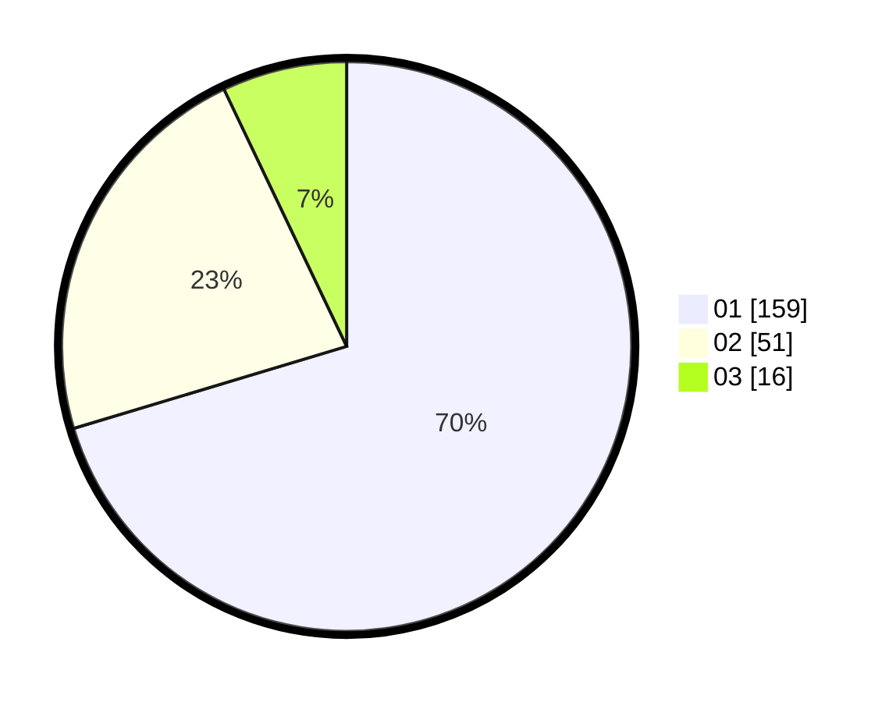

# Hasil

Hasil perolehan suara paslon dapat dilihat pada file paslon-01.txt, paslon-02.txt, dan paslon-03.txt.

Jika tidak ada, artinya data tersebut belum ada pada SIREKAP.

## Perolehan Suara

 * Paslon 01: **159**.
 * Paslon 02: **51**.
 * Paslon 03: **16**.

## Foto C Plano

https://sirekap-obj-formc.kpu.go.id/253d/pemilu/ppwp/31/75/07/10/01/3175071001128-20240214-155016--7e95a804-6c26-4001-87a5-260b43b9f483.jpg

https://sirekap-obj-formc.kpu.go.id/253d/pemilu/ppwp/31/75/07/10/01/3175071001128-20240214-155026--b24a5149-3b0b-4382-a3dd-6ea9bbe565da.jpg

https://sirekap-obj-formc.kpu.go.id/253d/pemilu/ppwp/31/75/07/10/01/3175071001128-20240214-155030--667aceb7-78f1-47fc-a74a-84650bf951de.jpg

## DATA PEMILIH TETAP

Jumlah pemilih dalam DPT: **263**.
 * L: **136**.
 * P: **127**.

## DATA PENGGUNA HAK PILIH

Jumlah pengguna hak pilih dalam DPT: **225**.
 * L: **113**.
 * P: **112**.

Jumlah pengguna hak pilih dalam DPTb: **5**.
 * L: **1**.
 * P: **4**.

Jumlah pengguna hak pilih dalam DPK: **1**.
 * L: **0**.
 * P: **1**.

Jumlah pengguna hak pilih: **231**.
 * L: **114**.
 * P: **117**.

## JUMLAH SUARA SAH DAN TIDAK SAH

JUMLAH SELURUH SUARA SAH: **226**.

JUMLAH SUARA TIDAK SAH: **5**.

JUMLAH SELURUH SUARA SAH DAN SUARA TIDAK SAH: **231**.
