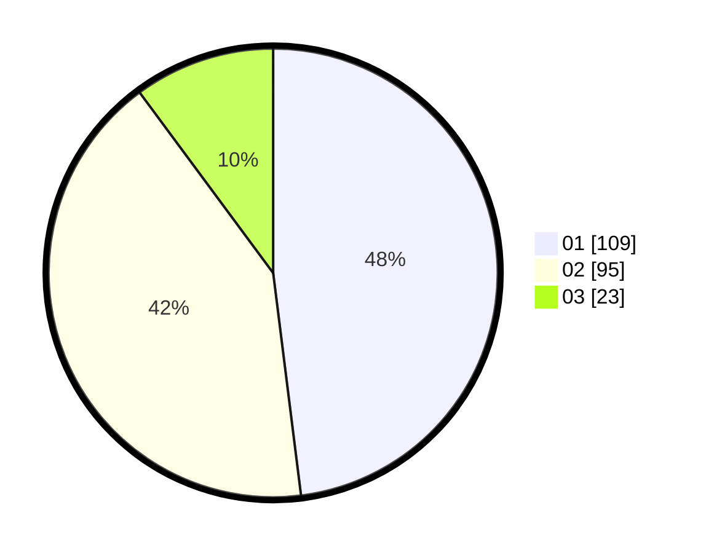

# Hasil

Hasil perolehan suara paslon dapat dilihat pada file paslon-01.txt, paslon-02.txt, dan paslon-03.txt.

Jika tidak ada, artinya data tersebut belum ada pada SIREKAP.

## Perolehan Suara

 * Paslon 01: **109**.
 * Paslon 02: **95**.
 * Paslon 03: **23**.

## Foto C Plano

https://sirekap-obj-formc.kpu.go.id/28c9/pemilu/ppwp/31/75/07/10/01/3175071001133-20240214-224652--e31cf103-0401-4e7b-a4e7-ef64e0c3193e.jpg

https://sirekap-obj-formc.kpu.go.id/28c9/pemilu/ppwp/31/75/07/10/01/3175071001133-20240214-224805--f58a2cec-e375-4940-9345-acf61b8c9931.jpg

https://sirekap-obj-formc.kpu.go.id/28c9/pemilu/ppwp/31/75/07/10/01/3175071001133-20240214-224848--f0588fe7-edea-4a51-9619-4ebefd43a319.jpg

## DATA PEMILIH TETAP

Jumlah pemilih dalam DPT: **272**.
 * L: **137**.
 * P: **135**.

## DATA PENGGUNA HAK PILIH

Jumlah pengguna hak pilih dalam DPT: **224**.
 * L: **107**.
 * P: **117**.

Jumlah pengguna hak pilih dalam DPTb: **3**.
 * L: **2**.
 * P: **1**.

Jumlah pengguna hak pilih dalam DPK: **2**.
 * L: **0**.
 * P: **2**.

Jumlah pengguna hak pilih: **229**.
 * L: **109**.
 * P: **120**.

## JUMLAH SUARA SAH DAN TIDAK SAH

JUMLAH SELURUH SUARA SAH: **227**.

JUMLAH SUARA TIDAK SAH: **2**.

JUMLAH SELURUH SUARA SAH DAN SUARA TIDAK SAH: **229**.
