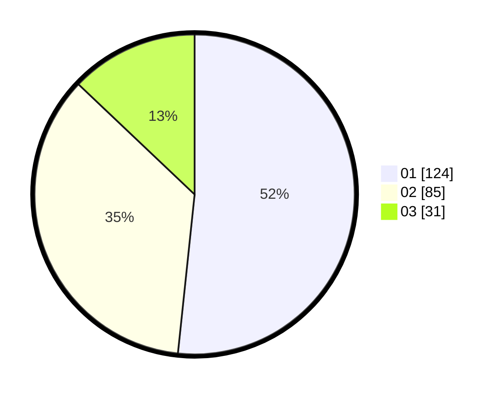

# Hasil

Hasil perolehan suara paslon dapat dilihat pada file paslon-01.txt, paslon-02.txt, dan paslon-03.txt.

Jika tidak ada, artinya data tersebut belum ada pada SIREKAP.

## Perolehan Suara

 * Paslon 01: **124**.
 * Paslon 02: **85**.
 * Paslon 03: **31**.

## Foto C Plano

https://sirekap-obj-formc.kpu.go.id/df34/pemilu/ppwp/31/75/07/10/01/3175071001135-20240214-194113--15fd4740-1e3d-4976-8259-c08ed1caf94c.jpg

https://sirekap-obj-formc.kpu.go.id/df34/pemilu/ppwp/31/75/07/10/01/3175071001135-20240214-194215--eb0c07ec-4987-45b3-b8a8-d7675014f186.jpg

https://sirekap-obj-formc.kpu.go.id/df34/pemilu/ppwp/31/75/07/10/01/3175071001135-20240214-194318--0f464444-4832-4792-aefc-1bb529e9bce3.jpg

## DATA PEMILIH TETAP

Jumlah pemilih dalam DPT: **261**.
 * L: **123**.
 * P: **138**.

## DATA PENGGUNA HAK PILIH

Jumlah pengguna hak pilih dalam DPT: **230**.
 * L: **109**.
 * P: **121**.

Jumlah pengguna hak pilih dalam DPTb: **12**.
 * L: **5**.
 * P: **7**.

Jumlah pengguna hak pilih dalam DPK: **4**.
 * L: **1**.
 * P: **3**.

Jumlah pengguna hak pilih: **246**.
 * L: **115**.
 * P: **131**.

## JUMLAH SUARA SAH DAN TIDAK SAH

JUMLAH SELURUH SUARA SAH: **240**.

JUMLAH SUARA TIDAK SAH: **6**.

JUMLAH SELURUH SUARA SAH DAN SUARA TIDAK SAH: **246**.
