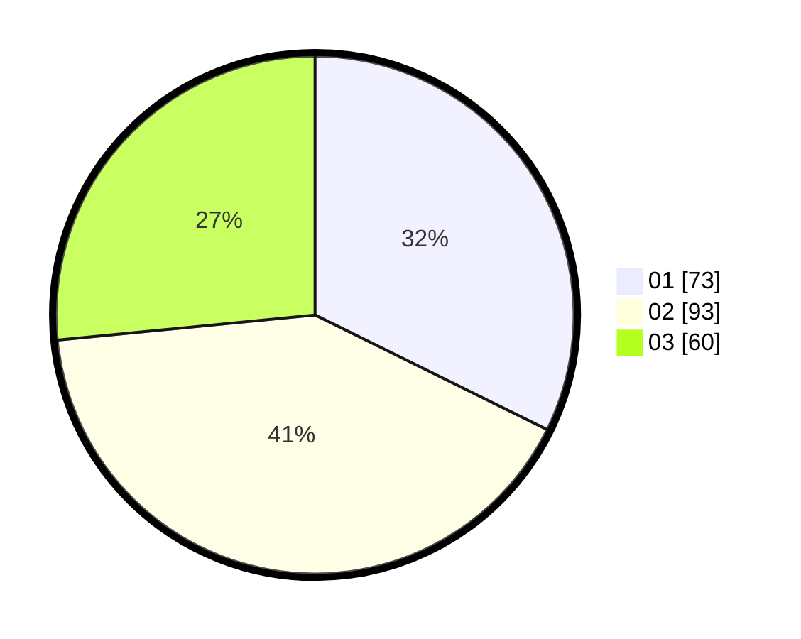

# Hasil

Hasil perolehan suara paslon dapat dilihat pada file paslon-01.txt, paslon-02.txt, dan paslon-03.txt.

Jika tidak ada, artinya data tersebut belum ada pada SIREKAP.

## Perolehan Suara

 * Paslon 01: **73**.
 * Paslon 02: **93**.
 * Paslon 03: **60**.

## Foto C Plano

https://sirekap-obj-formc.kpu.go.id/0338/pemilu/ppwp/31/75/07/10/01/3175071001143-20240216-004551--1e6c1be7-a59e-4cfc-8078-9611820d6d8a.jpg

https://sirekap-obj-formc.kpu.go.id/0338/pemilu/ppwp/31/75/07/10/01/3175071001143-20240215-231126--f7d7517b-f6c6-4d81-afcb-67847993a794.jpg

https://sirekap-obj-formc.kpu.go.id/0338/pemilu/ppwp/31/75/07/10/01/3175071001143-20240214-223400--d384628d-fd91-4fd7-805c-2e5ae3ec71c5.jpg
