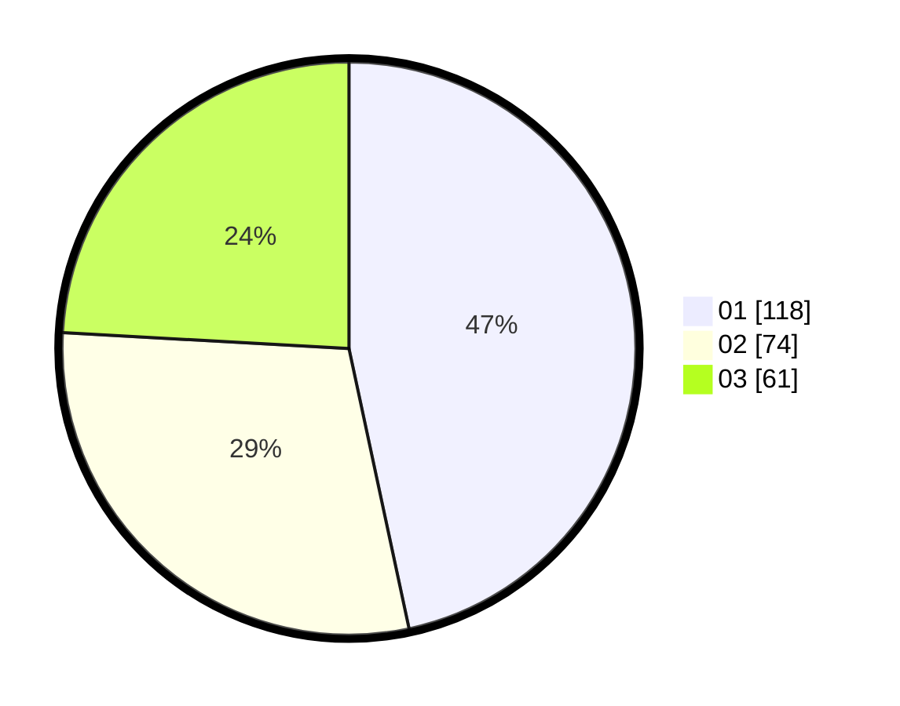

# Hasil

Hasil perolehan suara paslon dapat dilihat pada file paslon-01.txt, paslon-02.txt, dan paslon-03.txt.

Jika tidak ada, artinya data tersebut belum ada pada SIREKAP.

## Perolehan Suara

 * Paslon 01: **118**.
 * Paslon 02: **74**.
 * Paslon 03: **61**.

## Foto C Plano

https://sirekap-obj-formc.kpu.go.id/3a44/pemilu/ppwp/31/75/07/10/01/3175071001150-20240215-020822--962067db-67a9-40fa-bb3e-46ff09783309.jpg

https://sirekap-obj-formc.kpu.go.id/3a44/pemilu/ppwp/31/75/07/10/01/3175071001150-20240215-020918--6f5290c1-d1ba-4222-ab3e-cfa66db67088.jpg

https://sirekap-obj-formc.kpu.go.id/3a44/pemilu/ppwp/31/75/07/10/01/3175071001150-20240215-021006--8f5463d7-97ac-498e-869b-eeba3cd54419.jpg
