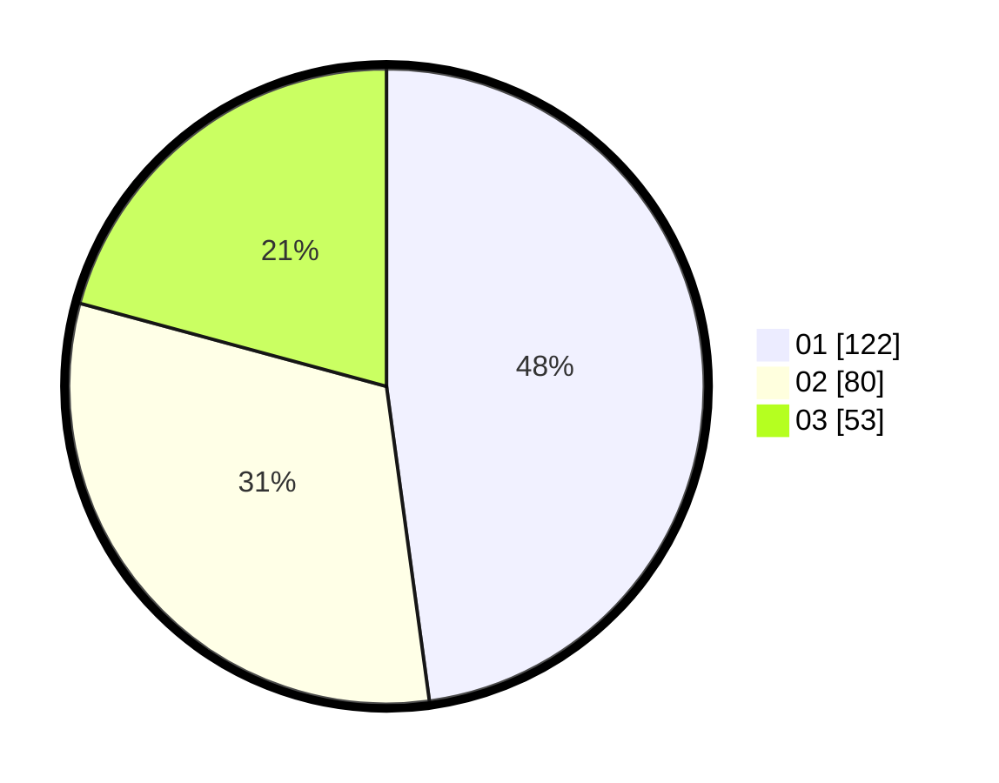

# Hasil

Hasil perolehan suara paslon dapat dilihat pada file paslon-01.txt, paslon-02.txt, dan paslon-03.txt.

Jika tidak ada, artinya data tersebut belum ada pada SIREKAP.

## Perolehan Suara

 * Paslon 01: **122**.
 * Paslon 02: **80**.
 * Paslon 03: **53**.

## Foto C Plano

https://sirekap-obj-formc.kpu.go.id/2cf3/pemilu/ppwp/31/75/07/10/01/3175071001151-20240215-012053--3bff2d4f-f992-47cd-862c-872723183a1f.jpg

https://sirekap-obj-formc.kpu.go.id/2cf3/pemilu/ppwp/31/75/07/10/01/3175071001151-20240215-030735--9a44ef13-cad3-4d37-9e16-6f2c4b817274.jpg

https://sirekap-obj-formc.kpu.go.id/2cf3/pemilu/ppwp/31/75/07/10/01/3175071001151-20240215-012339--cfff0296-a336-439d-9c1b-44a3bfd4858b.jpg

## DATA PEMILIH TETAP

Jumlah pemilih dalam DPT: **293**.
 * L: **144**.
 * P: **149**.

## DATA PENGGUNA HAK PILIH

Jumlah pengguna hak pilih dalam DPT: **253**.
 * L: **129**.
 * P: **124**.

Jumlah pengguna hak pilih dalam DPTb: **1**.
 * L: **1**.
 * P: **0**.

Jumlah pengguna hak pilih dalam DPK: **3**.
 * L: **1**.
 * P: **2**.

Jumlah pengguna hak pilih: **257**.
 * L: **131**.
 * P: **126**.

## JUMLAH SUARA SAH DAN TIDAK SAH

JUMLAH SELURUH SUARA SAH: **255**.

JUMLAH SUARA TIDAK SAH: **2**.

JUMLAH SELURUH SUARA SAH DAN SUARA TIDAK SAH: **257**.
