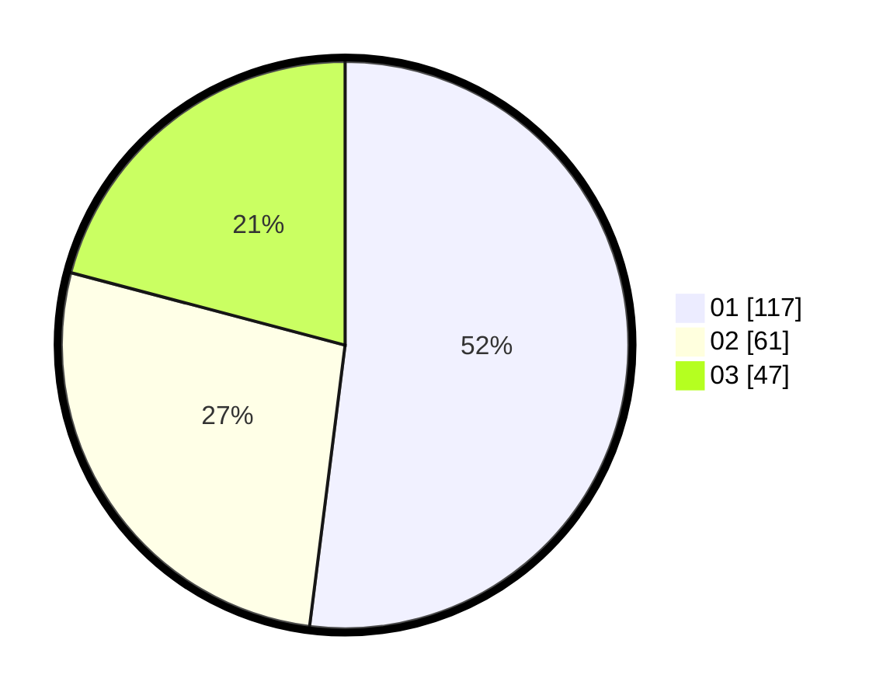

# Hasil

Hasil perolehan suara paslon dapat dilihat pada file paslon-01.txt, paslon-02.txt, dan paslon-03.txt.

Jika tidak ada, artinya data tersebut belum ada pada SIREKAP.

## Perolehan Suara

 * Paslon 01: **117**.
 * Paslon 02: **61**.
 * Paslon 03: **47**.

## Foto C Plano

https://sirekap-obj-formc.kpu.go.id/5d80/pemilu/ppwp/31/75/07/10/01/3175071001164-20240214-193448--f3cd2b68-1fb4-4d9a-a378-01f4768e68eb.jpg

https://sirekap-obj-formc.kpu.go.id/5d80/pemilu/ppwp/31/75/07/10/01/3175071001164-20240214-201201--60aa4c80-138a-4e97-8201-75dfc98e8146.jpg

https://sirekap-obj-formc.kpu.go.id/5d80/pemilu/ppwp/31/75/07/10/01/3175071001164-20240214-193419--31a196e9-dc14-4754-86f5-3289c9eeb122.jpg

## DATA PEMILIH TETAP

Jumlah pemilih dalam DPT: **263**.
 * L: **126**.
 * P: **137**.

## DATA PENGGUNA HAK PILIH

Jumlah pengguna hak pilih dalam DPT: **219**.
 * L: **103**.
 * P: **116**.

Jumlah pengguna hak pilih dalam DPTb: **7**.
 * L: **2**.
 * P: **5**.

Jumlah pengguna hak pilih dalam DPK: **1**.
 * L: **0**.
 * P: **1**.

Jumlah pengguna hak pilih: **227**.
 * L: **105**.
 * P: **122**.

## JUMLAH SUARA SAH DAN TIDAK SAH

JUMLAH SELURUH SUARA SAH: **225**.

JUMLAH SUARA TIDAK SAH: **2**.

JUMLAH SELURUH SUARA SAH DAN SUARA TIDAK SAH: **227**.
