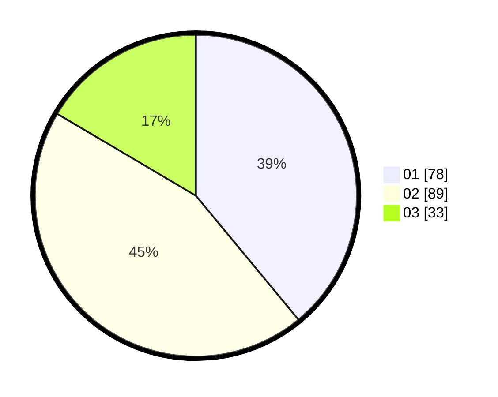

# Hasil

Hasil perolehan suara paslon dapat dilihat pada file paslon-01.txt, paslon-02.txt, dan paslon-03.txt.

Jika tidak ada, artinya data tersebut belum ada pada SIREKAP.

## Perolehan Suara

 * Paslon 01: **78**.
 * Paslon 02: **89**.
 * Paslon 03: **33**.

## Foto C Plano

https://sirekap-obj-formc.kpu.go.id/eb34/pemilu/ppwp/31/75/07/10/01/3175071001166-20240214-235929--73e71a44-9b0f-4b7a-9cfd-3fb1a0089d94.jpg

https://sirekap-obj-formc.kpu.go.id/eb34/pemilu/ppwp/31/75/07/10/01/3175071001166-20240215-000421--2f13f596-b086-4c09-817c-2ce7fea21bef.jpg

https://sirekap-obj-formc.kpu.go.id/eb34/pemilu/ppwp/31/75/07/10/01/3175071001166-20240215-000543--2c0b4bce-f480-4693-b202-486ed9b4b55a.jpg

## DATA PEMILIH TETAP

Jumlah pemilih dalam DPT: **257**.
 * L: **132**.
 * P: **125**.

## DATA PENGGUNA HAK PILIH

Jumlah pengguna hak pilih dalam DPT: **200**.
 * L: **107**.
 * P: **93**.

Jumlah pengguna hak pilih dalam DPTb: **0**.
 * L: **0**.
 * P: **0**.

Jumlah pengguna hak pilih dalam DPK: **2**.
 * L: **1**.
 * P: **1**.

Jumlah pengguna hak pilih: **202**.
 * L: **108**.
 * P: **94**.

## JUMLAH SUARA SAH DAN TIDAK SAH

JUMLAH SELURUH SUARA SAH: **200**.

JUMLAH SUARA TIDAK SAH: **2**.

JUMLAH SELURUH SUARA SAH DAN SUARA TIDAK SAH: **202**.
