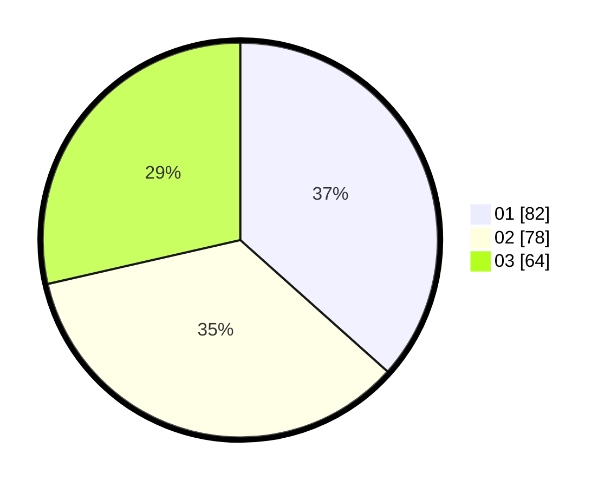

# Hasil

Hasil perolehan suara paslon dapat dilihat pada file paslon-01.txt, paslon-02.txt, dan paslon-03.txt.

Jika tidak ada, artinya data tersebut belum ada pada SIREKAP.

## Perolehan Suara

 * Paslon 01: **82**.
 * Paslon 02: **78**.
 * Paslon 03: **64**.

## Foto C Plano

https://sirekap-obj-formc.kpu.go.id/f367/pemilu/ppwp/31/75/07/10/01/3175071001176-20240214-212451--0f49dfbf-50c3-4510-ba8a-7128cc5ed2e6.jpg

https://sirekap-obj-formc.kpu.go.id/f367/pemilu/ppwp/31/75/07/10/01/3175071001176-20240215-002204--cc03fbf8-f39f-4ce1-8fd3-d650bd87f396.jpg

https://sirekap-obj-formc.kpu.go.id/f367/pemilu/ppwp/31/75/07/10/01/3175071001176-20240215-002345--ced15e02-1a90-4b8f-ae6d-807db4096d5d.jpg

## DATA PEMILIH TETAP

Jumlah pemilih dalam DPT: **273**.
 * L: **125**.
 * P: **148**.

## DATA PENGGUNA HAK PILIH

Jumlah pengguna hak pilih dalam DPT: **219**.
 * L: **95**.
 * P: **124**.

Jumlah pengguna hak pilih dalam DPTb: **4**.
 * L: **1**.
 * P: **3**.

Jumlah pengguna hak pilih dalam DPK: **3**.
 * L: **3**.
 * P: **0**.

Jumlah pengguna hak pilih: **226**.
 * L: **99**.
 * P: **127**.

## JUMLAH SUARA SAH DAN TIDAK SAH

JUMLAH SELURUH SUARA SAH: **224**.

JUMLAH SUARA TIDAK SAH: **2**.

JUMLAH SELURUH SUARA SAH DAN SUARA TIDAK SAH: **226**.
