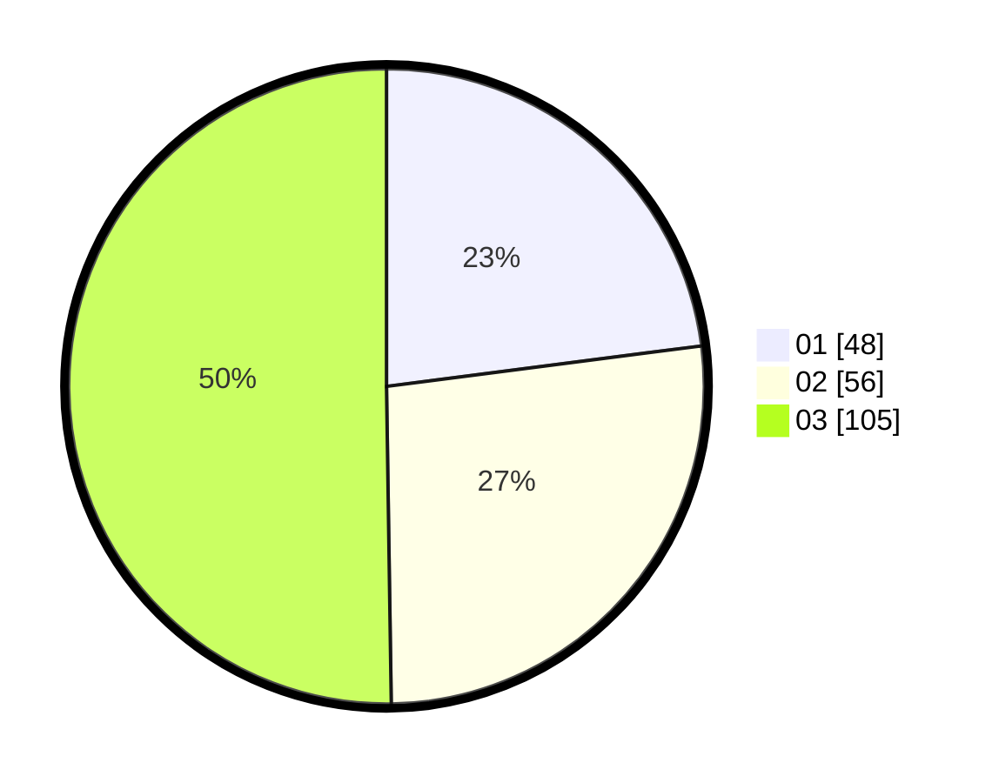

# Hasil

Hasil perolehan suara paslon dapat dilihat pada file paslon-01.txt, paslon-02.txt, dan paslon-03.txt.

Jika tidak ada, artinya data tersebut belum ada pada SIREKAP.

## Perolehan Suara

 * Paslon 01: **48**.
 * Paslon 02: **56**.
 * Paslon 03: **105**.

## Foto C Plano

https://sirekap-obj-formc.kpu.go.id/a523/pemilu/ppwp/31/75/07/10/01/3175071001180-20240214-201805--082cd5d3-c225-4504-b3d6-8d48bef2d23e.jpg

https://sirekap-obj-formc.kpu.go.id/a523/pemilu/ppwp/31/75/07/10/01/3175071001180-20240214-201111--d63efcfc-8bdb-4212-b949-408231bce010.jpg

https://sirekap-obj-formc.kpu.go.id/a523/pemilu/ppwp/31/75/07/10/01/3175071001180-20240214-201202--7231aea4-0878-4813-8b42-ba79291a9249.jpg

## DATA PEMILIH TETAP

Jumlah pemilih dalam DPT: **260**.
 * L: **120**.
 * P: **140**.

## DATA PENGGUNA HAK PILIH

Jumlah pengguna hak pilih dalam DPT: **207**.
 * L: **95**.
 * P: **112**.

Jumlah pengguna hak pilih dalam DPTb: **5**.
 * L: **2**.
 * P: **3**.

Jumlah pengguna hak pilih dalam DPK: **0**.
 * L: **0**.
 * P: **0**.

Jumlah pengguna hak pilih: **212**.
 * L: **97**.
 * P: **115**.

## JUMLAH SUARA SAH DAN TIDAK SAH

JUMLAH SELURUH SUARA SAH: **209**.

JUMLAH SUARA TIDAK SAH: **3**.

JUMLAH SELURUH SUARA SAH DAN SUARA TIDAK SAH: **212**.
