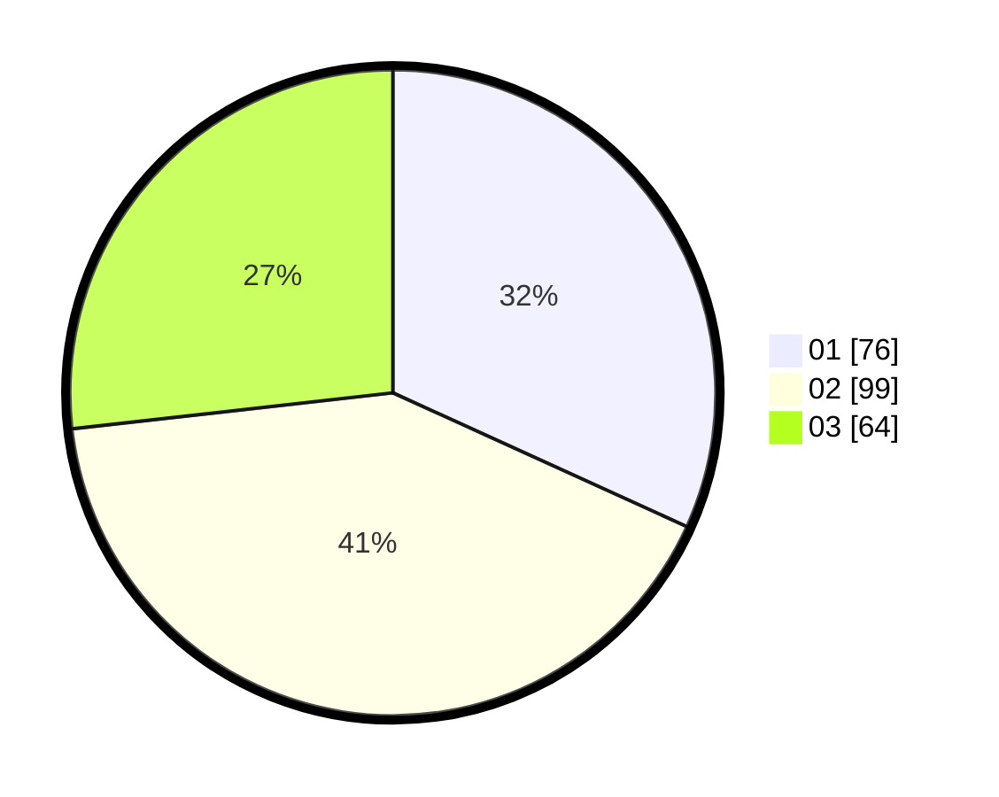

# Hasil

Hasil perolehan suara paslon dapat dilihat pada file paslon-01.txt, paslon-02.txt, dan paslon-03.txt.

Jika tidak ada, artinya data tersebut belum ada pada SIREKAP.

## Perolehan Suara

 * Paslon 01: **76**.
 * Paslon 02: **99**.
 * Paslon 03: **64**.

## Foto C Plano

https://sirekap-obj-formc.kpu.go.id/5d06/pemilu/ppwp/31/75/07/10/01/3175071001182-20240214-155252--858569d2-4754-48d6-badc-b3fee06852b0.jpg

https://sirekap-obj-formc.kpu.go.id/5d06/pemilu/ppwp/31/75/07/10/01/3175071001182-20240214-155135--23a27978-93a0-471a-971c-ea024e69a8df.jpg

https://sirekap-obj-formc.kpu.go.id/5d06/pemilu/ppwp/31/75/07/10/01/3175071001182-20240214-155403--587a862e-b350-4db4-bd98-e40ee260a814.jpg

## DATA PEMILIH TETAP

Jumlah pemilih dalam DPT: **274**.
 * L: **131**.
 * P: **143**.

## DATA PENGGUNA HAK PILIH

Jumlah pengguna hak pilih dalam DPT: **234**.
 * L: **115**.
 * P: **119**.

Jumlah pengguna hak pilih dalam DPTb: **4**.
 * L: **2**.
 * P: **2**.

Jumlah pengguna hak pilih dalam DPK: **1**.
 * L: **1**.
 * P: **0**.

Jumlah pengguna hak pilih: **239**.
 * L: **118**.
 * P: **121**.

## JUMLAH SUARA SAH DAN TIDAK SAH

JUMLAH SELURUH SUARA SAH: **239**.

JUMLAH SUARA TIDAK SAH: **0**.

JUMLAH SELURUH SUARA SAH DAN SUARA TIDAK SAH: **239**.
