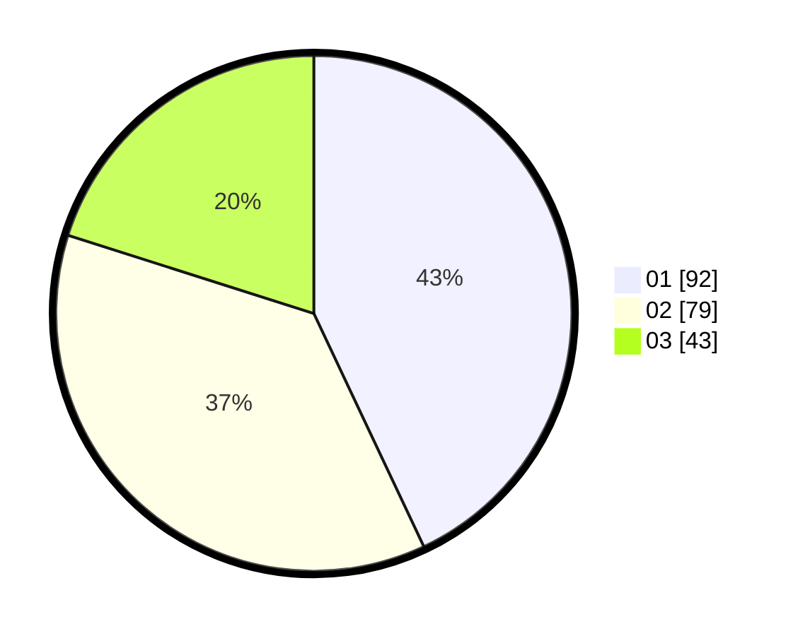

# Hasil

Hasil perolehan suara paslon dapat dilihat pada file paslon-01.txt, paslon-02.txt, dan paslon-03.txt.

Jika tidak ada, artinya data tersebut belum ada pada SIREKAP.

## Perolehan Suara

 * Paslon 01: **92**.
 * Paslon 02: **79**.
 * Paslon 03: **43**.

## Foto C Plano

https://sirekap-obj-formc.kpu.go.id/5df7/pemilu/ppwp/31/75/07/10/01/3175071001183-20240214-155839--0e4d1dd6-a475-4244-a212-7f955979acf8.jpg

https://sirekap-obj-formc.kpu.go.id/5df7/pemilu/ppwp/31/75/07/10/01/3175071001183-20240214-185427--65616b0e-c7f7-4bfd-92c5-e5e3e18c6ec2.jpg

https://sirekap-obj-formc.kpu.go.id/5df7/pemilu/ppwp/31/75/07/10/01/3175071001183-20240214-185527--70c08a71-47fe-46da-ba9d-c90c1132dc1d.jpg

## DATA PEMILIH TETAP

Jumlah pemilih dalam DPT: **267**.
 * L: **127**.
 * P: **140**.

## DATA PENGGUNA HAK PILIH

Jumlah pengguna hak pilih dalam DPT: **206**.
 * L: **105**.
 * P: **101**.

Jumlah pengguna hak pilih dalam DPTb: **3**.
 * L: **3**.
 * P: **0**.

Jumlah pengguna hak pilih dalam DPK: **6**.
 * L: **1**.
 * P: **5**.

Jumlah pengguna hak pilih: **215**.
 * L: **109**.
 * P: **106**.

## JUMLAH SUARA SAH DAN TIDAK SAH

JUMLAH SELURUH SUARA SAH: **214**.

JUMLAH SUARA TIDAK SAH: **1**.

JUMLAH SELURUH SUARA SAH DAN SUARA TIDAK SAH: **215**.
