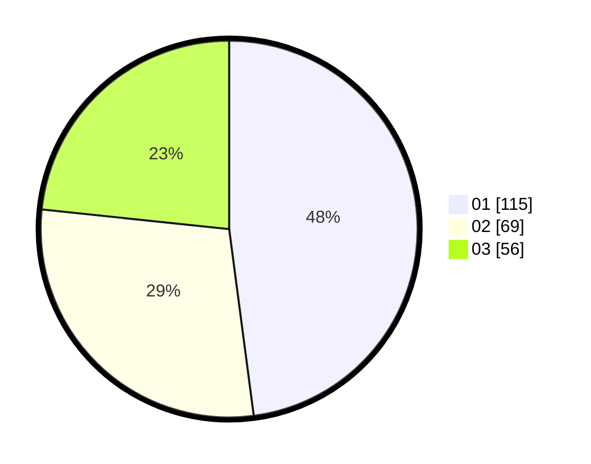

# Hasil

Hasil perolehan suara paslon dapat dilihat pada file paslon-01.txt, paslon-02.txt, dan paslon-03.txt.

Jika tidak ada, artinya data tersebut belum ada pada SIREKAP.

## Perolehan Suara

 * Paslon 01: **115**.
 * Paslon 02: **69**.
 * Paslon 03: **56**.

## Foto C Plano

https://sirekap-obj-formc.kpu.go.id/3ef1/pemilu/ppwp/31/75/07/10/01/3175071001184-20240214-231739--3983b6cb-33e3-49c4-915c-c6019655c9cd.jpg

https://sirekap-obj-formc.kpu.go.id/3ef1/pemilu/ppwp/31/75/07/10/01/3175071001184-20240214-231744--7d20aefb-0434-4851-8a63-42d415c0c067.jpg

https://sirekap-obj-formc.kpu.go.id/3ef1/pemilu/ppwp/31/75/07/10/01/3175071001184-20240214-231748--36d616a0-841c-4ad6-a2e0-34cd49d158e6.jpg
