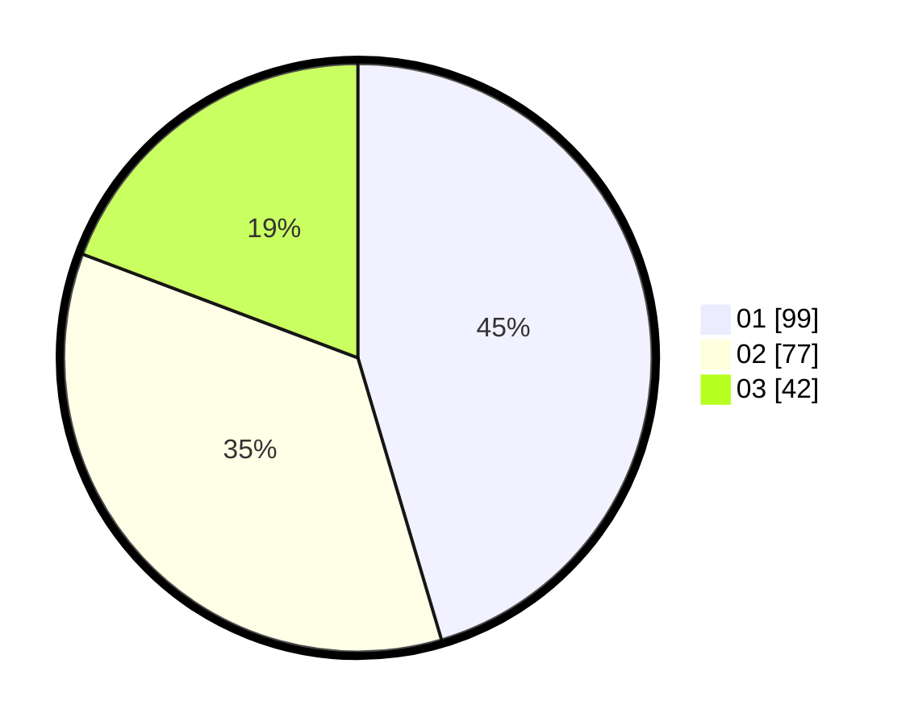

# Hasil

Hasil perolehan suara paslon dapat dilihat pada file paslon-01.txt, paslon-02.txt, dan paslon-03.txt.

Jika tidak ada, artinya data tersebut belum ada pada SIREKAP.

## Perolehan Suara

 * Paslon 01: **99**.
 * Paslon 02: **77**.
 * Paslon 03: **42**.

## Foto C Plano

https://sirekap-obj-formc.kpu.go.id/3974/pemilu/ppwp/31/75/07/10/01/3175071001187-20240215-015450--11134f02-84d5-402d-b701-c6e2fbfb9c29.jpg

https://sirekap-obj-formc.kpu.go.id/3974/pemilu/ppwp/31/75/07/10/01/3175071001187-20240214-195021--d3eb178b-796f-4621-a1e4-518fade3a765.jpg

https://sirekap-obj-formc.kpu.go.id/3974/pemilu/ppwp/31/75/07/10/01/3175071001187-20240214-201652--25f38754-1b34-4001-87d2-c7104661dc03.jpg

## DATA PEMILIH TETAP

Jumlah pemilih dalam DPT: **266**.
 * L: **127**.
 * P: **139**.

## DATA PENGGUNA HAK PILIH

Jumlah pengguna hak pilih dalam DPT: **216**.
 * L: **102**.
 * P: **114**.

Jumlah pengguna hak pilih dalam DPTb: **7**.
 * L: **6**.
 * P: **1**.

Jumlah pengguna hak pilih dalam DPK: **0**.
 * L: **0**.
 * P: **0**.

Jumlah pengguna hak pilih: **223**.
 * L: **108**.
 * P: **115**.

## JUMLAH SUARA SAH DAN TIDAK SAH

JUMLAH SELURUH SUARA SAH: **218**.

JUMLAH SUARA TIDAK SAH: **5**.

JUMLAH SELURUH SUARA SAH DAN SUARA TIDAK SAH: **223**.
