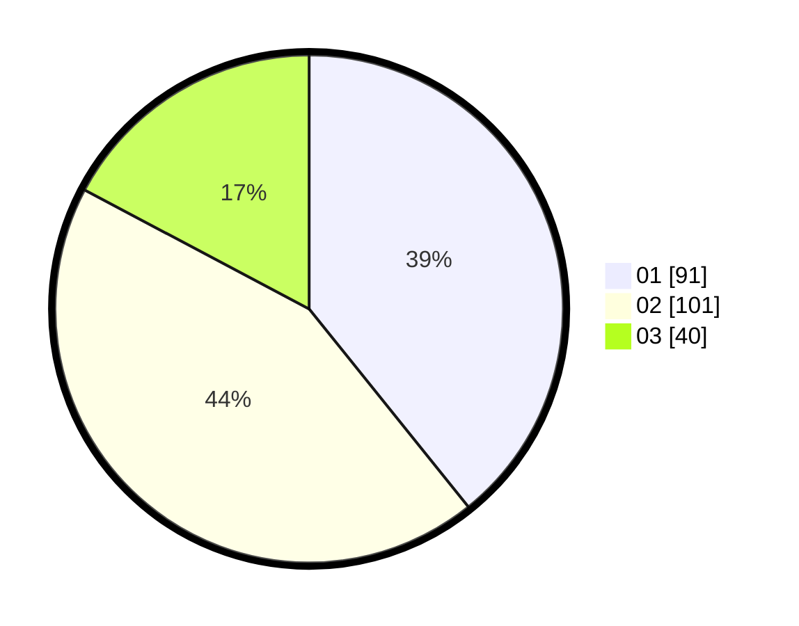

# Hasil

Hasil perolehan suara paslon dapat dilihat pada file paslon-01.txt, paslon-02.txt, dan paslon-03.txt.

Jika tidak ada, artinya data tersebut belum ada pada SIREKAP.

## Perolehan Suara

 * Paslon 01: **91**.
 * Paslon 02: **101**.
 * Paslon 03: **40**.

## Foto C Plano

https://sirekap-obj-formc.kpu.go.id/9cec/pemilu/ppwp/31/75/07/10/01/3175071001190-20240214-155254--8bedb19c-88a4-4d43-8009-5b0d73edd716.jpg

https://sirekap-obj-formc.kpu.go.id/9cec/pemilu/ppwp/31/75/07/10/01/3175071001190-20240214-155632--13189c80-47ed-4708-9c5b-83e2a2b7af24.jpg

https://sirekap-obj-formc.kpu.go.id/9cec/pemilu/ppwp/31/75/07/10/01/3175071001190-20240216-034909--5e1d8427-8e3b-4455-b0aa-ffa473b0aa4d.jpg

## DATA PEMILIH TETAP

Jumlah pemilih dalam DPT: **263**.
 * L: **131**.
 * P: **132**.

## DATA PENGGUNA HAK PILIH

Jumlah pengguna hak pilih dalam DPT: **225**.
 * L: **114**.
 * P: **111**.

Jumlah pengguna hak pilih dalam DPTb: **0**.
 * L: **0**.
 * P: **0**.

Jumlah pengguna hak pilih dalam DPK: **9**.
 * L: **5**.
 * P: **4**.

Jumlah pengguna hak pilih: **234**.
 * L: **119**.
 * P: **115**.

## JUMLAH SUARA SAH DAN TIDAK SAH

JUMLAH SELURUH SUARA SAH: **232**.

JUMLAH SUARA TIDAK SAH: **2**.

JUMLAH SELURUH SUARA SAH DAN SUARA TIDAK SAH: **234**.
