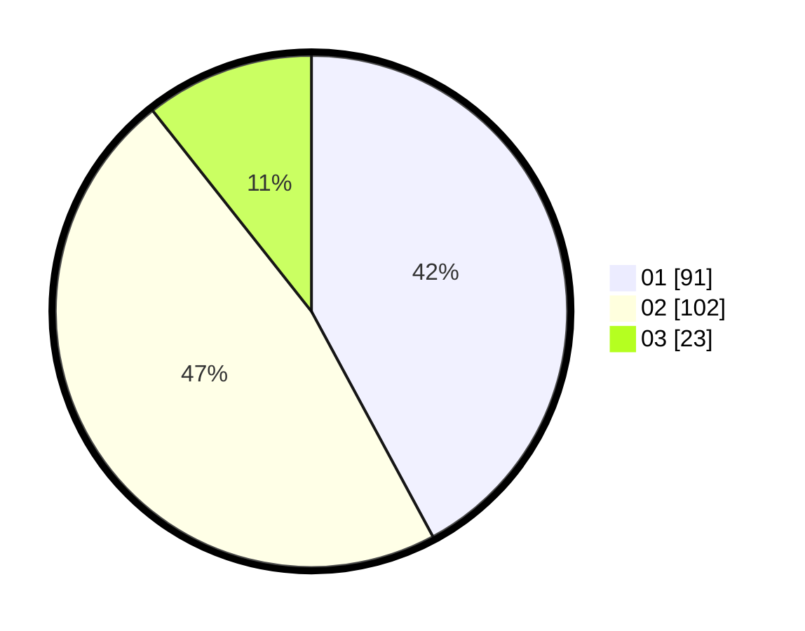

# Hasil

Hasil perolehan suara paslon dapat dilihat pada file paslon-01.txt, paslon-02.txt, dan paslon-03.txt.

Jika tidak ada, artinya data tersebut belum ada pada SIREKAP.

## Perolehan Suara

 * Paslon 01: **91**.
 * Paslon 02: **102**.
 * Paslon 03: **23**.

## Foto C Plano

https://sirekap-obj-formc.kpu.go.id/87a5/pemilu/ppwp/31/75/07/10/01/3175071001191-20240214-155845--0615323e-d669-4aa3-9f9a-03efab82b9c9.jpg

https://sirekap-obj-formc.kpu.go.id/87a5/pemilu/ppwp/31/75/07/10/01/3175071001191-20240214-191722--53f06b43-dcd7-4936-a8f0-90213d1ffae1.jpg

https://sirekap-obj-formc.kpu.go.id/87a5/pemilu/ppwp/31/75/07/10/01/3175071001191-20240214-185157--7be20773-1974-44c3-8bb2-0081f504ebef.jpg

## DATA PEMILIH TETAP

Jumlah pemilih dalam DPT: **269**.
 * L: **141**.
 * P: **128**.

## DATA PENGGUNA HAK PILIH

Jumlah pengguna hak pilih dalam DPT: **214**.
 * L: **112**.
 * P: **102**.

Jumlah pengguna hak pilih dalam DPTb: **1**.
 * L: **0**.
 * P: **1**.

Jumlah pengguna hak pilih dalam DPK: **3**.
 * L: **1**.
 * P: **2**.

Jumlah pengguna hak pilih: **218**.
 * L: **113**.
 * P: **105**.

## JUMLAH SUARA SAH DAN TIDAK SAH

JUMLAH SELURUH SUARA SAH: **216**.

JUMLAH SUARA TIDAK SAH: **2**.

JUMLAH SELURUH SUARA SAH DAN SUARA TIDAK SAH: **218**.
