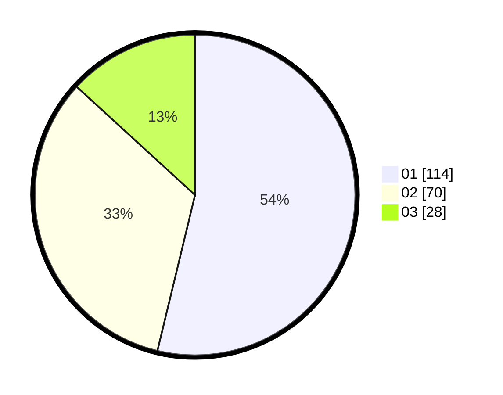

# Hasil

Hasil perolehan suara paslon dapat dilihat pada file paslon-01.txt, paslon-02.txt, dan paslon-03.txt.

Jika tidak ada, artinya data tersebut belum ada pada SIREKAP.

## Perolehan Suara

 * Paslon 01: **114**.
 * Paslon 02: **70**.
 * Paslon 03: **28**.

## Foto C Plano

https://sirekap-obj-formc.kpu.go.id/8f51/pemilu/ppwp/31/75/07/10/01/3175071001192-20240215-005146--022dba87-dcde-4c54-93b0-56a75d2e352d.jpg

https://sirekap-obj-formc.kpu.go.id/8f51/pemilu/ppwp/31/75/07/10/01/3175071001192-20240215-005305--d93feb59-afbf-497b-9dd7-eeba42d5bd64.jpg

https://sirekap-obj-formc.kpu.go.id/8f51/pemilu/ppwp/31/75/07/10/01/3175071001192-20240215-005406--38656383-2ff5-401a-a63e-2872fc9b2c46.jpg

## DATA PEMILIH TETAP

Jumlah pemilih dalam DPT: **271**.
 * L: **142**.
 * P: **129**.

## DATA PENGGUNA HAK PILIH

Jumlah pengguna hak pilih dalam DPT: **271**.
 * L: **142**.
 * P: **129**.

Jumlah pengguna hak pilih dalam DPTb: **5**.
 * L: **2**.
 * P: **3**.

Jumlah pengguna hak pilih dalam DPK: **4**.
 * L: **3**.
 * P: **1**.

Jumlah pengguna hak pilih: **280**.
 * L: **147**.
 * P: **133**.

## JUMLAH SUARA SAH DAN TIDAK SAH

JUMLAH SELURUH SUARA SAH: **212**.

JUMLAH SUARA TIDAK SAH: **1**.

JUMLAH SELURUH SUARA SAH DAN SUARA TIDAK SAH: **213**.
